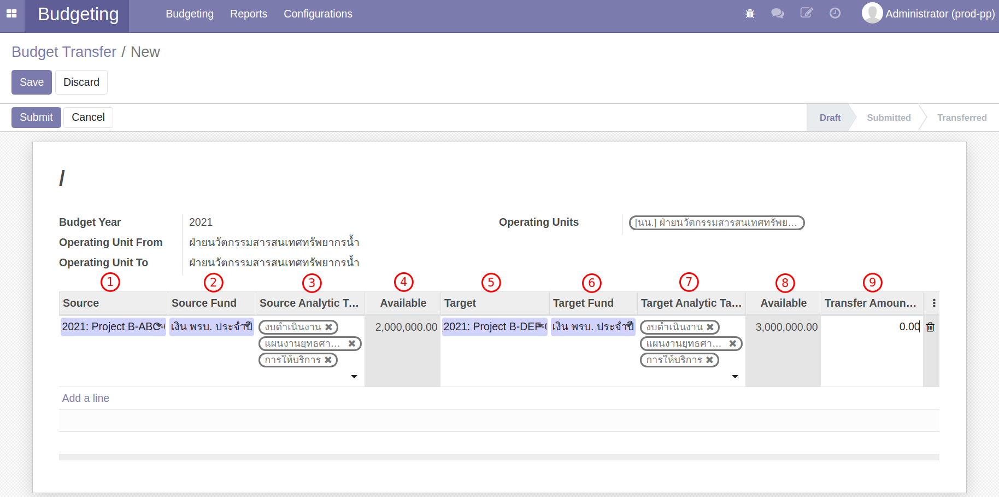
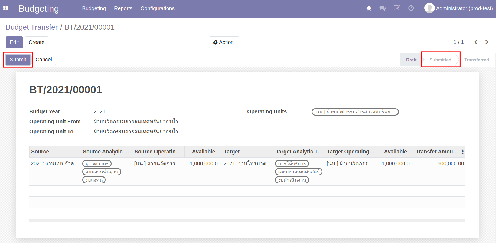
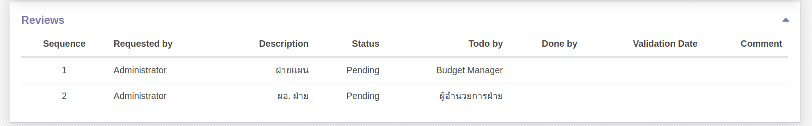

# กระบวนการโอนงบประมาณ

## ขั้นตอนการทำกระบวนการโอนงบประมาณ

ผู้ให้และผู้รับงบประมาณ มีการตกลงกันว่าต้องการโอนงบประมาณ จากนั้นจึงเริ่มการทำงานในระบบ โดยเริ่มจาก

1. หยุดการใช้งบประมาณบนระบบ
2. การสร้างเอกสาร Budget Transfer
3. แก้ไขแผนการใช้จ่าย หลังจากโอนงบประมาณเสร็จสิ้น

## ขั้นตอนการหยุดใช้งบประมาณบนระบบ

ทั้งผู้ให้และผู้รับงบประมาณ เข้าระบบเพื่อหยุดการใช้งบประมาณของตนเอง โดยทำตามขั้นตอน ดังนี้

**Menu ::** Budgeting > Budgeting > Budget Control Sheet

1. เข้าไปที่หน้า Budget Control Sheet ของตนเอง ระบบแสดงสถานะของ Budget Control Sheet เป็น Control
2. กดปุ่ม Reset to Draft เปลี่ยนสถานะเอกสารจาก Control เป็น Draft เพื่อหยุดการเบิกใช้งบประมาณ
    

## ขั้นตอนการสร้างเอกสาร Budget Transfer

**Menu ::** Budgeting > Budgeting > Budget Transfer

1. กดปุ่ม "Create" เพื่อสร้างเอกสาร
    

2. กดปุ่ม "Add a line" เพื่อกรอกรายละเอียด ดังนี้
    1. Source: เลือกผู้ให้งบประมาณ
    2. Source Analytic Tags: เลือก Tags ที่มี โดยระบบจะดึงค่าตั้งต้นให้ หาก Analytic Account นั้นมี Tags อย่างละ 1 ตัว
    3. Source Fund: แหล่งงบประมาณ
    4. Available: ยอดงบประมาณคงเหลือ
    5. Target: ผู้รับงบประมาณ
    6. Target Analytic Tags: Analytic Tags: เลือก Tags ที่มี โดยระบบจะดึงค่าตั้งต้นให้ หาก Analytic 
    7. Target Fund: แหล่งงบประมาณ
    8. Available: ยอดงบประมาณคงเหลือ
    9. **Transfer Amount: ยอดงบประมาณที่ต้องการโอน**
        

3. ตรวจสอบข้อมูล หากถูกต้องครบถ้วนกดปุ่ม "Save" หากต้องการแก้ไขกดปุ่ม "Edit"
4. กดปุ่ม "Submit" ระบบจะส่งเอกสารเพื่อขออนุมัติการโอนงบประมาณ
    - สถานะเอกสารเปลี่ยนจาก Draft เป็น Submit
        
    - Tab Review จะแสดงสถานะการอนุมัติ
        

    !!! Note
        หากฝ่ายแผนพิจารณาให้โอนงบประมาณได้ ระบบจะส่งเอกสารอนุมัติตามลำดับ
        

5. เมื่อได้รับการอนุมัติครบถ้วนแล้ว เอกสารจะเปลี่ยนสถานะจาก Sunmitted เป็น Transfered
    

## ขั้นตอนการแก้ไขแผนการใช้จ่าย หลังจากโอนงบประมาณเสร็จสิ้น

เมื่อทำการโอนงบประมาณเสร็จสิ้น ทั้งผู้ให้และผู้รับงปบระมาณ จะต้องวางแผนการใช้จ่ายใหม่ ตามกรอบงบประมาณที่เปลี่ยนแปลงไปจากการโอนงบประมาณ

**Menu ::** Budgeting > Budgeting > Budget Control Sheet

### ผู้ให้งบประมาณ

1. ผู้ให้งบประมาณ เมื่อโอนงบประมาณสำเร็จ กรอบงบประมาณ Release จะลดลงตามยอดงบประมาณที่โอน
    - Allocate: กรอบงบประมาณที่ได้รับการจัดสรรจากฝ่ายแผน
    - Release: กรอบงบประมาณล่าสุด
    - Diff: ผลต่างระหว่าง Release กับ ผลรวมงบประมาณที่วางแผนในปัจจุบัน

2. กดปุ่ม "Edit" เพื่อวางแผนการใช้จ่ายงบประมาณใหม่
    

!!! Note
    ระบบไม่อนุญาติให้วางแผนการใช้จ่ายเดือนในอดีต
    หากวางแผนการใช้จ่ายส่วนใหญ่อยู่ในอดีตจะไม่สามารถแก้ไขได้ ให้วางแผนแบบ ติดลบ เพื่อให้ผลรวมงบประมาณเท่ากับ Release

3. เมื่อแก้ไขแผนการใช้จ่ายเสร็จสิ้น กดปุ่ม "Save" เพื่อบันทึกข้อมูล
4. กดปุ่ม "Submit" และ "Control" เพื่อเริ่มการใช้จ่ายงบประมาณอีกครั้ง

### ผู้รับงบประมาณ

1. ผู้รับงบประมาณ เมื่อโอนงบประมาณสำเร็จ กรอบงบประมาณ Release จะเพิ่มขึ้นตามยอดงบประมาณที่โอน
    - Allocate: กรอบงบประมาณที่ได้รับการจัดสรรจากฝ่ายแผน
    - Release: กรอบงบประมาณล่าสุด
    - Diff: ผลต่างระหว่าง Release กับ ผลรวมงบประมาณที่วางแผนในปัจจุบัน

2. กดปุ่ม "Edit" เพื่อวางแผนการใช้จ่ายงบประมาณใหม่
    

    !!! Note
        ระบบไม่อนุญาติให้วางแผนการใช้จ่ายเดือนในอดีต หากวางแผนการใช้จ่ายส่วนใหญ่อยู่ในอดีตจะไม่สามารถแก้ไขได้ ให้วางแผนแบบ ติดลบ เพื่อให้ผลรวมงบประมาณเท่ากับ Release

3. เมื่อแก้ไขแผนการใช้จ่ายเสร็จสิ้น กดปุ่ม "Save" เพื่อบันทึกข้อมูล
4. กดปุ่ม "Submit" และ "Control" เพื่อเริ่มการใช้จ่ายงบประมาณอีกครั้ง

## ข้อมูลการใช้งบประมาณของ Budget Control Sheet

ที่หน้า Budget Control Sheet (Form View) มี Smart Button
    
1. Monitoring: แสดงการใช้จ่ายงบประมาณ
    
2. Transferred: แสดงรายละเอียดการโอนงบประมาณที่เกิดขึ้น
    1. รายละเอียดของผู้โอนงบประมาณ
    2. รายละเอียดผู้รับงบประมาณ
    3. ยอดงบประมาณที่ถูกโอน
    