# กระบวนการปรับแผน

กระบวนการปรับแผนในระบบ จะทำการปรับกรอบงบประมาณของทั้งระบบให้เป็นไปตามกรอบงบประมาณใหม่ที่ต้องการจัดสรร

## รายงาน Budget Revision Monitoring

สามารถดูรายงานที่ **Menu ::** Budgeting > Reporting > Budget Revision Monitoring

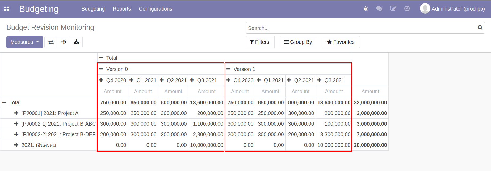

## ขั้นตอนการปรับแผนงบประมาณ

**Menu ::** Budgeting > Budgeting > Budget Plan

1. เลือกเอกสาร Budget Plan Version ปัจจุบัน
    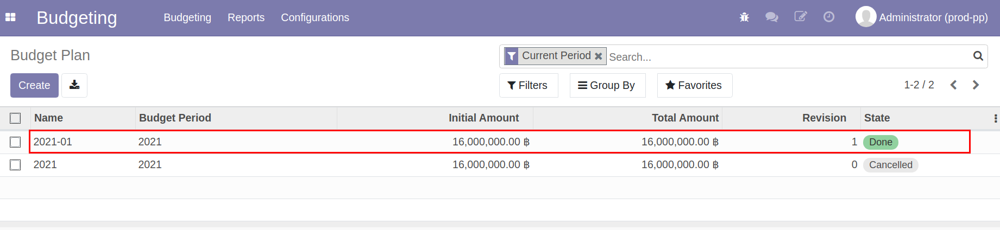

2. เอกสารจะแสดง Revision ปัจจุบันอยู่ที่ 1 และสถานะเอกสารอยู่ที่ Done กดปุ่ม "New Revision"
    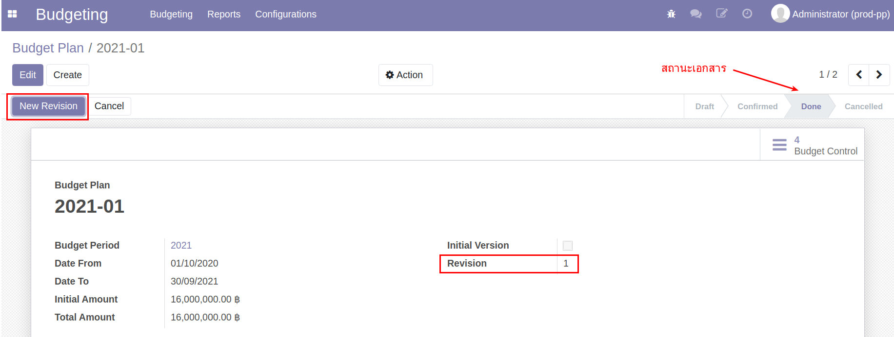

3. ระบบสร้าง Budget Plan Version ใหม่
    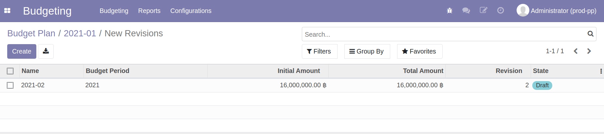

4. ไปที่ **Menu ::** Budgeting > Budgeting > Budget Allocation เพื่อแก้ไขกรอบงบประมาณใหม่ตามกรอบงบประมาณที่ได้รับการอนุมัติจากการประชุม
    - กดปุ่ม "Reset to draft" เพื่อเริ่มแก้ไขกรอบงบประมาณ
    

5. เริ่มการแก้ไขกรอบงบประมาณ
    1. กดปุ่ม "Edit"
    2. Release: แสดงกรอบงบประมาณปัจจุบัน ที่เปลี่ยนแปลงตามการโอนงบประมาณ
    3. Allocate: *แก้ไขกรอบงบประมาณใหม่* ที่ต้องการปรับแผน
    4. ในกรณีที่ต้องการเพิ่มโครงการ สามารถกดปุ่ม "Add a line" และเริ่มแจกกรอบเพิ่มเติม
    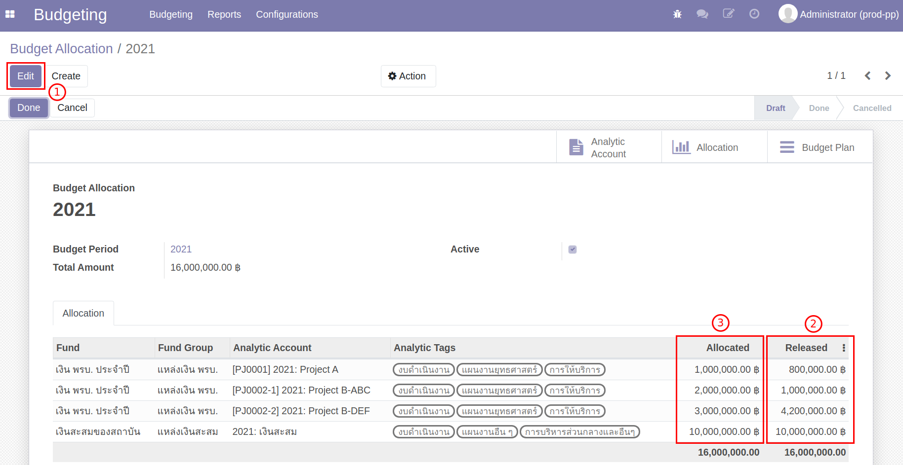

6. กด "Save" เพื่อบันทึกข้อมูล หากถูกต้องครบถ้วน กด "Done" สถานะเอกสารเปลี่ยนจาก Draft เป็น Done 

6. กลับมาที่ **Menu ::** Budgeting > Budgeting > Budget Plan
    - กดปุ่ม "Generate Plan"
    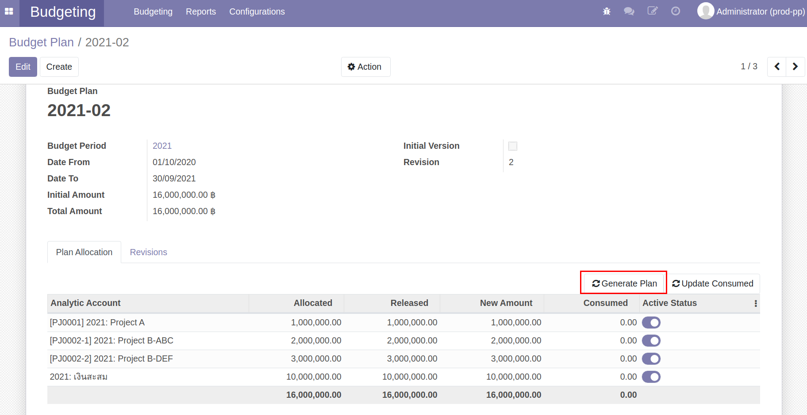
    - ระบบจะอัพเดตข้อมูลกรอบงบประมาณใหม่ที่แก้ไขในหน้า Budget Allocaiton
        - ถูกต้องครบถ้วน กดปุ่ม "Restart Validation" เพื่อเริ่มขออนุมัติกรอบงบประมาณบนระบบ
        - หากต้องการแก้ไข จะต้องการไปแก้ที่หน้า Budget Allocation ตามข้อ 4-6
    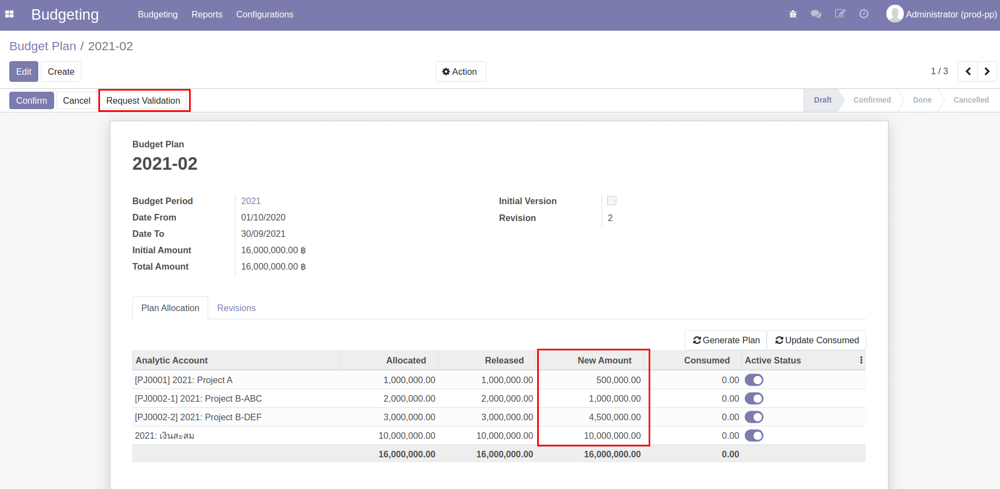

7. เมื่อได้รับการอนุมัติ เรีบยร้อยแล้ว
    - ไปที่ **Menu ::** Budgeting > Budgeting > Budget Control Sheet
        1. เลือก Budget Control Sheet ทั้งหมด
        2. กดปุ่ม "Action"
        3. กดปุ่ม "Cancel" เพื่อหยุดการใช้งบประมาณ Version ปัจจุบัน
        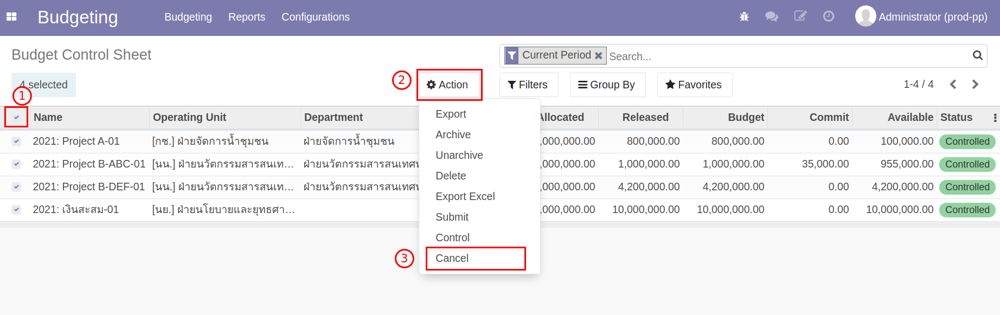

    - ไปที่ **Menu ::** Budgeting > Budgeting > Budget Plan
      1. สถานะเอกสารจะเปลี่ยนจาก Draft เป็น Confirmed
      2. กดปุ่ม "Create/Update Budget Control" เพื่อสร้าง Budget Control Sheet Version ใหม่
        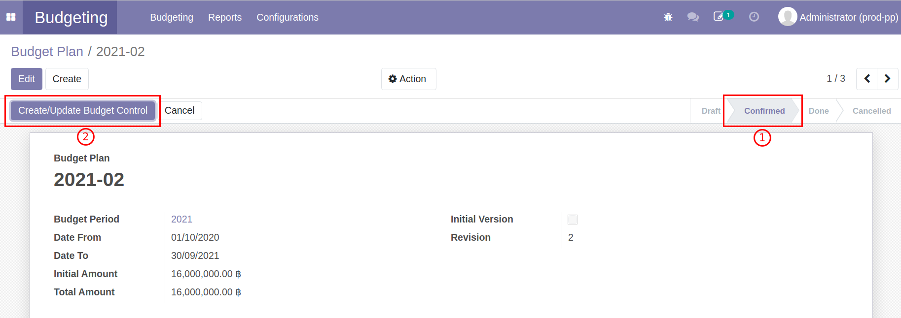

8. ระบบแสดงหน้าต่าง
    1. หากมีโครงการเพิ่มขึ้น ระบบจะแสดงการสร้าง Budget Control Sheet
    2. แสดงการอัพเดต Budget Control Sheet Version ใหม่
    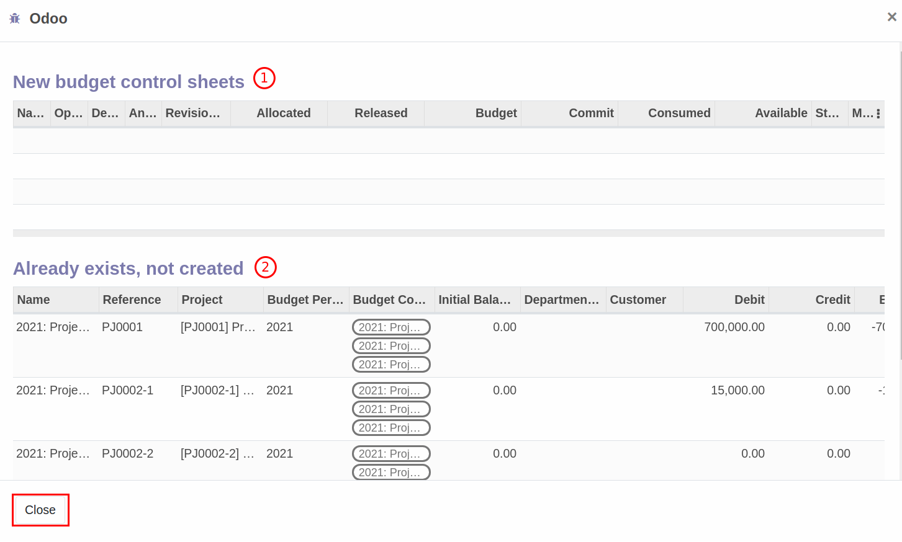

9. กดปุ่ม "Done" เพื่อสิ้นสุดการปรับแผน สถานะเอกสารเปลี่ยนจาก Confirmed เป็น Done
    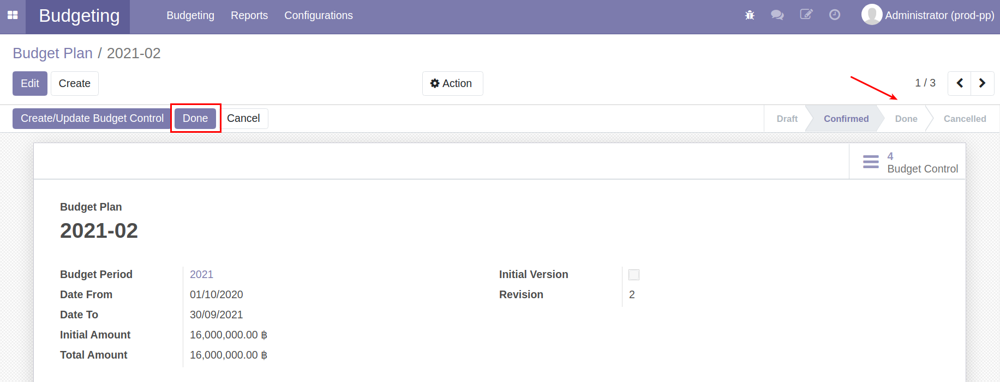

## วางแผนการใช้จ่ายงบประมาณหลังการปรับแผน

หลังจากปรับกรอบงบประมาณเสร็จสิ้น ทำการวางแผนการใช้จ่ายใหม่ตามกรอบที่ได้รับ Allcated สามารถดูวิธีแก้ไข Budget Control Sheet ได้ที่   
[การวางแผนการใช้จ่ายบนระบบ](1_budget/2_phasing_plan/phasing_plan_manual.md)