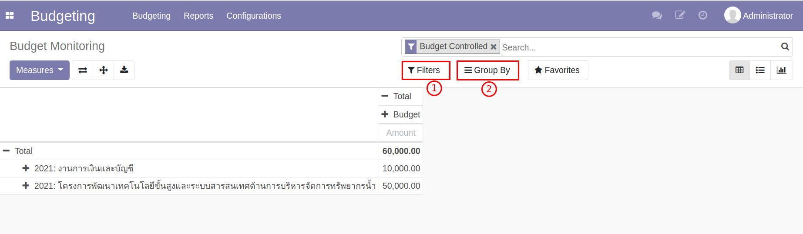

# รายงานงบประมาณ (Budget Monitoring)

**Menu ::** Budgeting > Reports > Budget Monitoring

รายงานงบประมาณในระบบเป็นการแสดงแบบ Real-Time และสามารถดูได้หลายมุมมอง โดยจะมีการตั้งค่าเริ่มต้นให้เห็นเฉพาะ Budget Control ที่อยู่ในสถานะใช้งาน (State Controlled) 

1. Filters: การแสดงเฉพาะสิ่งที่เราต้องการเห็น
2. Group By: การแสดงเอกสารจำแนกตาม Group ที่เลือก

