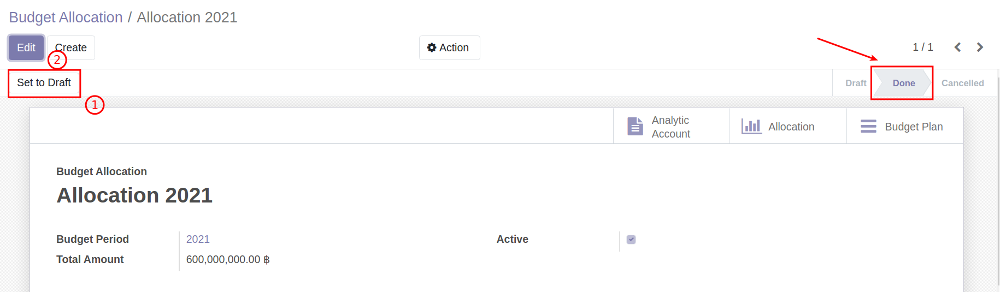

# การโอนงบประมาณให้ Cost Center ที่ไม่เคยได้รับการจัดสรรงบประมาณตอนต้นปี

หลังจากที่มีการตกลงกันภายนอกระบบว่าต้องการโอนงบประมาณ สิ่งที่ต้องทำคือ
1. แจ้งให้ฝ่ายแผนใส่ Analytic Tags ในระบบ
2. เริ่มทำงานตามขั้นตอนการโอนงบประมาณ

## ขั้นตอนการใส่ Analytic Tags

**Menu ::** Budgeting > Budgeting > Budget Allocation
1. ที่เมนู Budget Allocation ตรวจสอบสถานะของเอกสาร จะอยู่ที่ Confirmed
    1. กดปุ่ม "Set to draft" เพื่อเปลี่ยนสถานะเอกสารจาก Confirmed เป็น Draft
    2. กดปุ่ม "Edit" เพื่อใส่ Analytic Tags
    

2. กด "Add a line" เพื่อเพิ่ม Analytic Tags ให้กับ Cost Center ที่ยังไม่เคยมี Analytic Tags
    1. เลือก Fund
    2. เลือก Analytic Account
    3. เลือก Analytic Tags
    

3. กดปุ่ม "Save" ตรวจสอบข้อมูล
    - ถูกต้องครบถ้วน กดปุ่ม "Done" เพื่อเปลี่ยนสถานะเอกสารจาก Draft เป็น Done
    - หากต้องการแก้ไข กดปุ่ม "Edit"

สิ้นสุดการเพิ่ม Analytic Tags จากนั้นแจ้งให้พนักงานทั่วไป เริ่มทำเอกสารการโอนงบประมาณ ตามขั้นตอน [กระบวนการโอนงบประมาณ](1_budget/../3_budget_transfer/budget_transfer.md)