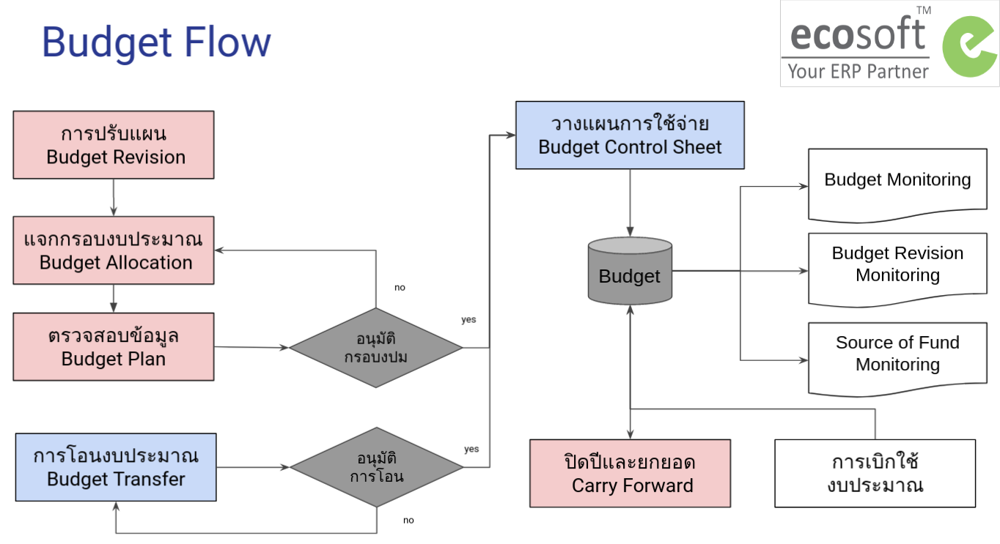

# ระบบบริหารงบประมาณ (Budgeting Management System)

## ภาพรวมกระบวนการทำงาน (Budget Work Flow)

## กระบวนการทำงาน (Budget Process)

1. [การสร้างข้อมูลหลัก](1_budget/../0_master_data/master_data.md)
2. [กระบวนการแจกกรอบงบประมาณ](1_budget/../1_budget_allocation/allocation.md)
3. [กระบวนการวางแผนการใช้จ่ายงบประมาณ](1_budget/../2_phasing_plan/phasing_plan.md)
      - [การวางแผนการใช้จ่ายงบประมาณบนExcel](1_budget/../2_phasing_plan/phasing_plan_excel.md)
      - [การวางแผนการใช้จ่ายงบประมาณบนระบบ](1_budget/../2_phasing_plan/phasing_plan_manual.md)
4. [กระบวนการโอนงบประมาณ](1_budget/../3_budget_transfer/budget_transfer.md)
5. [กระบวนการปรับแผน](1_budget/../5_budget_revision/revision.md)
6. [กระบวนการปิดปีและยกยอดงบประมาณ](1_budget/../4_carry_forward/carry_forward.md)

## รายงาน (Budget Monitoring)

1. [Budget Monitoring](1_budget/../6_monitoring/1_budget_monitoring.md)
2. [Budget Revision Monitoring](1_budget/../6_monitoring/2_revision_monitoring.md)
3. [Source of Fund Monitoring](1_budget/../6_monitoring/3_sof_monitoring.md)

## User Roles

1. Budget Manager: ฝ่ายแผน
      1. เห็นทุกเอกสาร ของทุก Operating Unit
      2. เห็นทุกเมนูการทำงาน
2. Budget User: พนักงานทั่วไป
      1. เห็นเฉพาะเอกสารของตัวเอง ตาม Operating Unit
      2. เห็นเมนูการทำงาน เฉพาะ
         1. Budget Control Sheet
         2. Budget Transfer
         3. Budget Monitoring

## Use Case

1. [Source of Fund Monitoring](1_budget/../9_use_case/1_budget_transfer_not_allocation.md)
2. 