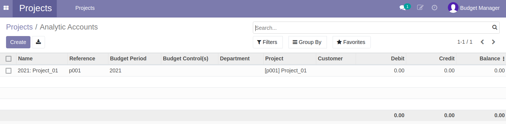

# การสร้างข้อมูลหลัก

## การสร้างข้อมูลโครงการ (Project และ Analytic Account)

**Menu ::** Projects > Project

### การสร้างข้อมูล Project

1. กดปุ่ม "Create" เพื่อสร้าง Project ใหม่ และกรอกรายละเอียด
    1. ชื่อ Project
    2. รหัส Project
    3. Project Manager: ผู้รับผิดชอบ Project
    4. Department: ฝ่ายของ Project นี้ ระบบจะมีค่าเริ่มต้นให้ตาม Project Manager
    5. วันที่เริ่มต้นโครงการ
    6. วันที่สิ้นสุดโครงการ
    7. Member Tab: รายชื่อสมาชิกใน Project

    

2. ตรวจสอบข้อมูลให้ถูกต้องครบถ้วน
    - ถูกต้องครบถ้วน กดปุ่ม "Save" เพื่อบันทึกข้อมูล
    - หากต้องการแก้ไขให้กดปุ่ม "Edit"
  
    **Note** โครงการจะต้องมีสถานะเป็น Draft เท่านั้นจึงจะแก้ไขข้อมูลได้

    

3. กดปุ่ม "Confirm" ระบบจะเปลี่ยนสถานะเป็น Confirmed 

    

    **สิ้นสุดการสร้าง Project**

### การสร้างข้อมูล Analytic Account

**Menu ::** Projects > Project

1. หน้า List view ของ Project
    1. เลือก Project ที่ต้องการสร้าง Analytic Account โดยการคลิกช่องสี่เหลี่ยม
    2. กดปุ่ม "Action"
    3. กดปุ่ม "Create Analytic"

    

!!! Note 
    Project สถานะ  Confirmed เท่านั้นถึงจะสามารถสร้าง Analytic Account ได้

2. ระบบแสดงหน้าต่าง
    1. Budget Period: ปีงบประมาณของ Analytic Account
    2. Group: กลุ่มของ Analytic
    3. กดปุ่ม "Create Analytic Account"
    
    

3.  ระบบจะสร้างและไปยังหน้า Analytic Account

    

4.  สิ้นสุดกระบวนการสร้าง Project และ Analytic Account

!!! Note
    Analytic Account จากฝ่าย (Department) จะถูกสร้างขึ้นอัตโนมัติ

## การสร้างข้อมูลแหล่งงบประมาณ (Source of Fund)

**Menu ::** Budgeting > Configurations  > Source of Fund

1. กดปุ่ม "Create" เพื่อสร้าง Source of Fund ใหม่ และกรอกรายละเอียด
    1. ตั้งชื่อแหล่งทุน
    2. เลือกกลุ่มของแหล่งทุน
    3. ตารางแสดงเงื่อนไขการกำหนดแหล่งทุน (Fund Constraint) ระบบจะแสดงให้อัตโนมัติ จากการทำงานที่หน้า Program Allocation
    4. Objective: วัตถุประสงค์ของแหล่งทุน (ถ้ามี)

    

2. ตรวจสอบข้อมูลให้ถูกต้องครบถ้วน
    - ถูกต้องครบถ้วน กดปุ่ม "Save" เพื่อบันทึกข้อมูล
    - หากต้องการแก้ไขให้กดปุ่ม "Edit"

    **สิ้นสุดกระบวนการสร้าง Source of Fund**

## การสร้างข้อมูลกลุ่มงบประมาณ (Program)

**Menu ::** Budgeting > Configurations > Program

1. กดปุ่ม "Create" เพื่อสร้างข้อมูล Program
    1. ตั้งชื่อ Program
    2. ตั้งรหัส Program (ถ้ามี)

    

2. ตรวจสอบข้อมูลให้ถูกต้องครบถ้วน
    - ถูกต้องครบถ้วน กดปุ่ม "Save" เพื่อบันทึกข้อมูล
    - หากต้องการแก้ไขให้กดปุ่ม "Edit"

## การสร้างข้อมูลแผนงาน (Work Plan)

**Menu ::** Budgeting > Configurations > Work Plan

1. กดปุ่ม "Create" เพื่อสร้างข้อมูล Work Plan
    1. ตั้งชื่อ Work Plan
    2. ตั้งรหัส Work Plan (ถ้ามี)

    

2. ตรวจสอบข้อมูลให้ถูกต้องครบถ้วน
    - ถูกต้องครบถ้วน กดปุ่ม "Save" เพื่อบันทึกข้อมูล
    - หากต้องการแก้ไขให้กดปุ่ม "Edit"

## การสร้างข้อมูลประเภทงบประมาณ (Budget Type)

**Menu ::** Budgeting > Configurations > Budget Type

1. กดปุ่ม "Create" เพื่อสร้างข้อมูล Budget Type
    1. ตั้งชื่อ Budget Type
    2. ตั้งรหัส Budget Type (ถ้ามี)

    

2. ตรวจสอบข้อมูลให้ถูกต้องครบถ้วน
    - ถูกต้องครบถ้วน กดปุ่ม "Save" เพื่อบันทึกข้อมูล
    - หากต้องการแก้ไขให้กดปุ่ม "Edit"