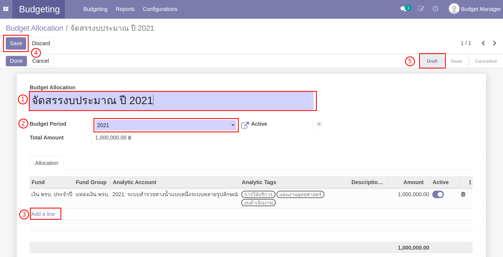
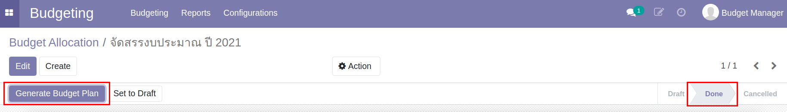
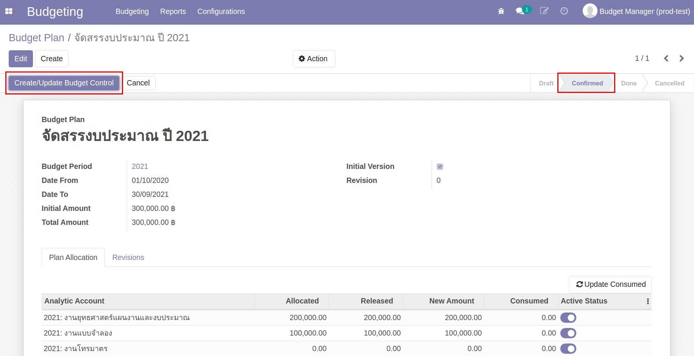
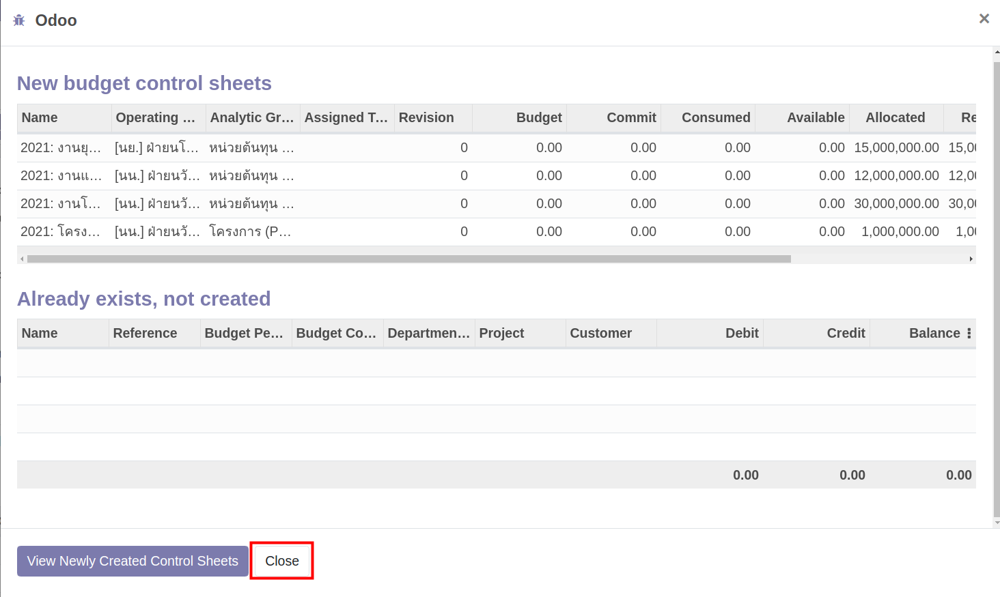

# การแจกกรอบงบประมาณ
กระบวนการแจกกรอบงบประมาณ (Budget Allocation)

ขั้นตอนการแจกกรอบงบประมาณ มีดังนี้

1. แจกกรอบงบประมาณตามแผนงาน, กลุ่มงบประมาณ และ ประเภทงบประมาณ (Budget Allocation)
2. ตรวจสอบข้อมูลการแจกกรอบงบประมาณ ในมุมมอง Analytic Account (Budget Plan)

ขั้นตอนการทำงาน

### แจกกรอบงบประมาณตามแผนงาน, กลุ่มงบประมาณ และ ประเภทงบประมาณ (Budget Allocation)

Menu :: Budgeting > Budgeting > Budget Allocation

กดปุ่ม "Create" เพื่อสร้างการแจกกรอบงบประมาณ (Budget Allocation)

1. ตั้งชื่อเอกสารสำหรับการแจกกรอบงบประมาณ
2. Budget Period: เลือกปีงบประมาณ
3. Add a line: เพื่อแจกรอบงบประมาณที่ละบรรทัด โดยเลือกข้อมูล ดังนี้
    * แหล่งทุน (Fund) ระบบจะแสดงกลุ่มของแหล่งทุน (Fund Group) ให้อัตโนมัติ
    * Analytic Account 
    * Analytic tags (กลุ่มงบประมาณ, แผนงาน, ประเภทงบประมาณ)
    * Fund Amount จำนวนเงินงบประมาณที่จัดสรรให้ข้อมูลบรรทัดนั้น
4. เมื่อจัดสรรงบประมาณครบถ้วนแล้ว กด "Save" เพื่อบันทึกข้อมูล และตรวจสอบความถูกต้องอีกครั้ง สถานะเอกสารยังคงเป็น Draft
    * ถ้าต้องการแก้ไข กด “Edit”
    * ถ้าข้อมูลถูกต้องครบถ้วน ยืนยันการจัดสรรงบประมาณ กด "Done" สถานะเอกสารเปลี่ยนจาก Draft เป็น Done

    

5. ระบบแสดงปุ่ม "Generate Budget Plan" กดเพื่อสร้างเอกสาร Budget Plan
 
    

สิ้นสุดการทำงานที่หน้า Budget Allocation

### ตรวจสอบข้อมูลการแจกกรอบงบประมาณ ในมุมมอง Analytic Account (Budget Plan)

Menu :: Budgeting > Budgeting > Budget Plan

เลือก Budget Plan ที่สร้างจาก Budget Allocation

1. ตรวจสอบข้อมูลตาม Analytic Account
2. ข้อมูลถูกต้องครบถ้วนแล้ว กด "Confirm" สถานะเอกสารเปลี่ยนจาก Draft > Confirmed
3. กดปุ่ม "Create/Update Budget Control" เพื่อสร้าง Budget Control Sheet
    
    

    ระบบแสดงหน้าต่างแสดงการสร้าง Budget Control Sheet กดปุ่ม "Close"
    

4. ตรวจสอบข้อมูล Budget Control Sheet ที่สร้าง 

    

5. หากถูกต้องครบถ้วน กลับมาที่ Menu :: Budget Plan กดปุ่ม "Done" เพื่อสิ้นสุดขั้นตอนการแจกกรอบงบประมาณ
    สถานะเอกสารเปลี่ยนจาก Confirmed > Done

สิ้นสุดการทำงานที่หน้า Budget Plan