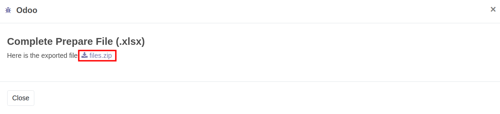
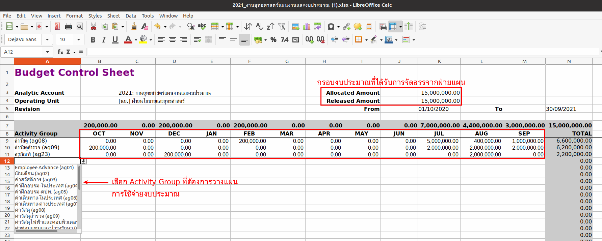
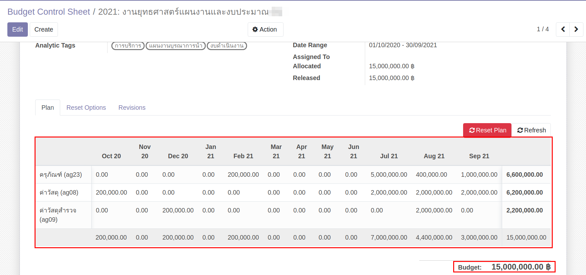

# การวางแผนการใช้จ่ายงบประมาณ

## การ Export Budget Control Sheet เพื่อให้พนักงานทั่วไปวางแผนการใช้จ่ายงบประมาณ

Menu :: Budgeting > Budgeting > Budget Control Sheet

## การ Export Excel Budget Control Sheet ออกจากระบบ

1. เลือก Budget Control Sheet ที่ต้องการ เพื่อ Export เอกสารให้พนักงานทั่วไปวางแผนการใช้จ่ายงบประมาณ
2. กดปุ่ม "Action"
3. กดปุ่ม "Export Excel" เพื่อ Export Budget Control Sheet ทั้งหมดที่เลือกในข้อ 1.

    

4. ระบบแสดงหน้าต่าง ดังนี้

    

5. หลังจากกด Export ระบบแสดงหน้าต่าง กดที่ "file.zip" เพื่อดาวน์โหลด ไฟล์ Excel Budget Control Sheet ทั้งหมดที่เลือกในข้อ 1

    

!!! Note
    ฝ่ายแผน ส่ง Excel File ให้พนักงานทั่วไปของสสน. วางแผนการใช้จ่าย เมื่อได้รับ Excel File ที่วางแผนการใช้จ่ายงบประมาณเสร็จสิ้น
    
    ตัวอย่างการวางแผนใน Excel file
    
    ตรวจสอบยอดรวมของเงินที่วางแผน จะต้องเท่ากับ Released (ยอดเงินที่ใช้ได้ปัจจุบัน)

## การ Import Excel Budget Control Sheet เข้าระบบ

Menu :: Budgeting > Budgeting > Budget Control Sheet

!!! Note
    เมื่อได้รับ Excel file แผนการใช้จ่ายงบประมาณจากพนักงานทั่วไป ตรวจสอบข้อมูล ความถูกต้อง และเริ่มนำ excel file เข้าระบบ

เลือก Budget Control Sheet ที่ต้องการ Import เข้าระบบ

1. กดปุ่ม "Action"
2. กดปุ่ม "Import Excel" เพื่อนำไฟล์ excel เข้าระบบ
    
3. ระบบแสดงหน้าต่าง ดังนี้
      1. กดปุ่ม "Upload your file"
      2. กดปุ่ม "Import"
    
4. เมื่อ Import ข้อมูลสำเร็จ ระบบจะแสดงหน้าต่าง กดปุ่ม "Close" เพื่อดูข้อมูลที่หน้า Budget Control Sheet
    

    **Note** :: เมื่อ Import สำเร็จ ที่หน้า Budget Control Sheet จะมีข้อมูลเหมือนใน Excel File
    

    เมื่อ Import Excel จนครบทุก Budget Control Sheet และเริ่มขั้นตอนจัดเก็บแผนการใช้จ่ายต้นปี (v.0) และส่งอนุมัติแผนการใช้จ่ายต้นปี (v.1)

## ขั้นตอนจัดเก็บแผนการใช้จ่ายต้นปี (v.0) และส่งอนุมัติแผนการใช้จ่ายต้นปี (v.1)

1. กดเพื่อเลือก Budget Control Sheet สถานะ Draft ทั้งหมด
2. กดปุ่ม "Action"
3. กดปุ่ม "Cancel" จะได้ Budget Control Sheet สถานะ Cancelled
    
        Menu :: Budgeting > Budgeting > Budget Plan
4. เลือก Budget Plan (Revision 0) ที่สร้างจาก Program Allocation ตอนต้นปี สถานะเอกสารอยู่ที่ Done
      1. กดปุ่ม "New Revision" 
        
5. ระบบจะสร้าง Budget Plan (Revision 1) สถานะเอกสารอยู่ที่ Draft
      1. กดปุ่ม "Request Validation" เพื่อส่งอนุมัติกรอบงบประมาณ
        
      2. ระบบจะแสดงที่ Tab "Reviews" แสดงลำดับและสถานะการอนุมัติ
        
    
     **Note** หากได้รับการอนุมัติแล้ว ระบบจะเปลี่ยนสถานะเอกสารจาก Draft เป็น Confirmed
        

6. หลังจากได้รับการอนุมัติกรอบงบประมาณ กดปุ่ม "Create/Update Budget Control"
    
7. ระบบจะเก็บแผนการใช้จ่าย Budget Control Sheet v.0 และสร้าง Budget Control Sheet v.1
    Menu :: Budgeting > Budgeting > Budget Control Sheet 
    ระบบสร้าง Budget Control Sheet (Revision 1)

      1. กดเพื่อเลือก Budget Control Sheet ทั้งหมด
      2. กดปุ่ม "Action"
      3. กดปุ่ม "Control" เพื่อเริ่มการใช้จ่ายงบประมาณ
            

8. หลังจาก "Control" Budget Control Sheet Revision 1 เสร็จสิ้น กลับมาที่ Menu :: Budget Plan
    กดปุ่ม "Done" เพื่อเปลี่ยนสถานะเอกสารจาก Confirmed เป็น Done เพื่อสิ้นสุดการทำงานของฝ่ายแผน
