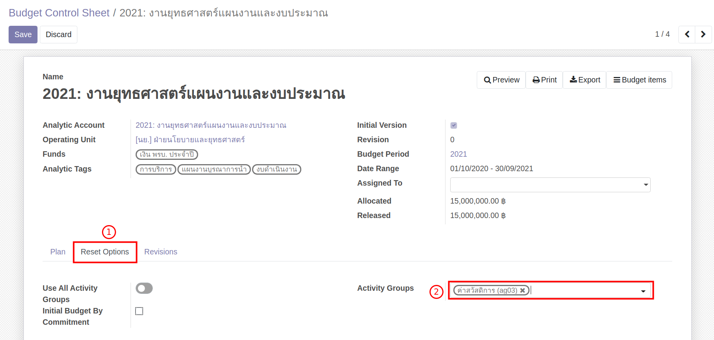
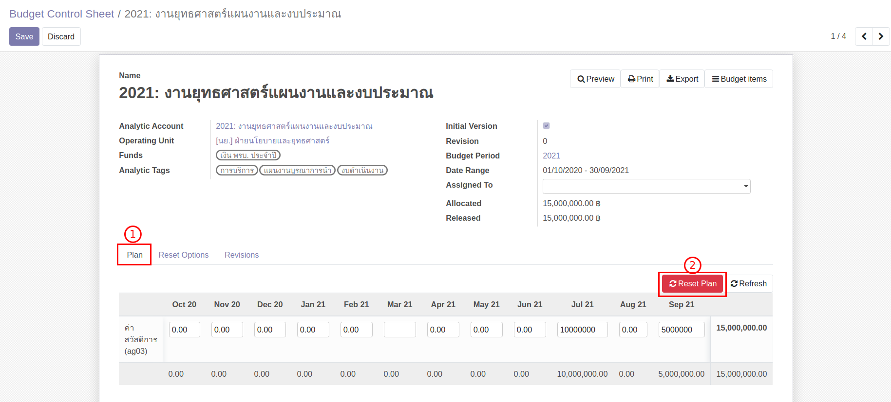

# การวางแผนการใช้งบประมาณบนระบบ

**Menu ::** Budgeting > Budgeting > Budget Control Sheet

1. เลือก Budget Control Sheet ที่ต้องการวางแผนงบประมาณ
2. กดปุ่ม "Edit" เพื่อแก้ไขข้อมูล
    1. ไปที่ Tab Reset Options: ใช้สำหรับการควบคุมการสร้าง Activity Group
    2. เลือก Activity Group ทั้งหมดที่ต้องการวางแผนการใช้จ่ายงบประมาณ
    3. ตรวจสอบข้อมูล ถูกต้องครบถ้วน กด "Save"

    

3. วางแผนการใช้จ่ายลงในตาราง ซึ่งมีขั้นตอนดังนี้
    1. ไปที่ Tab Plan
    2. กดปุ่ม "Reset Plan" เพื่อให้ระบบสร้างข้อมูลสำหรับการวางแผนการใช้จ่ายงบประมาณ
    3. กดปุ่ม "Edit" เพื่อที่จะสามารถแก้ไขตัวเลขข้อมูลการวางแผนได้
    4. กรอกตัวเลข วางแผนการใช้จ่ายลงในตาราง

    

4. ตรวจสอบยอดรวมของเงินที่วางแผน จะต้องเท่ากับ Released (ยอดเงินที่ใช้ได้ปัจจุบัน)
    

5. หากต้องการเพิ่ม Activity Group
    1. ไปที่ Tab Reset Options
    2. เลือก Activity Group ที่ต้องการเพิ่ม
    3. ไปที่ Tab Plan จากนั้นกดปุ่ม "Refresh"

6. ตรวจสอบข้อมูล ถูกต้องครบถ้วน 
    1. กด "Save" เพื่อบันทึกข้อมูล
    2. หากต้องการแก้ไข กดปุ่ม "Edit"
