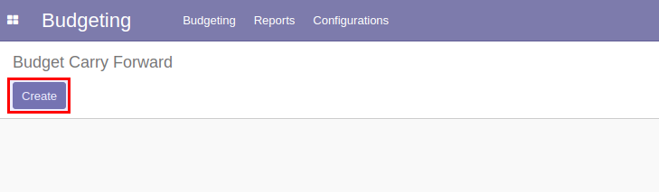

# กระบวนการปิดปีและยกยอดงบประมาณ

ขั้นตอนการทำกระบวนการปิดปีและยกยอดงบประมาณ มีดังนี้

1. หยุดการใช้งบประมาณบนระบบ
2. การสร้างเอกสาร Budget Carry Forward
3. ตรวจสอบข้อมูลเอกสาร Budget Carry Forward และยกยอดงบประมาณ

## ขั้นตอนการหยุดใช้งบประมาณบนระบบ

เข้าระบบเพื่อหยุดการใช้งบประมาณทั้งหมด โดยทำตามขั้นตอน ดังนี้

**Menu ::** Budgeting > Budgeting > Budget Control Sheet

1. เข้าไปที่หน้า Budget Control Sheet และเลือก Budget Control Sheet ทั้งหมดที่ Status เป็น Controlled อยู่
2. กดปุ่ม Action 
3. กดปุ่ม Cancel เพื่อเปลี่ยนสถานะเอกสารจาก Control เป็น Cancel เพื่อหยุดการเบิกใช้งบประมาณ

## ขั้นตอนการสร้างเอกสาร Budget Carry Forward

**Menu ::** Budgeting > Budgeting > Budget Carry Forward

1. กดปุ่ม "Create" เพื่อสร้างเอกสาร
    
2. กรอกข้อมูลในเอกสาร Budget Carry Forward 
    1. Name: ชื่อเอกสาร
    2. To Budget Period: ปีงบประมาณที่ต้องการยกยอดไป
    3. Method: วิธีการยกยอด
        - Extend: ขยายเวลาการใช้จ่ายงบประมาณ
        - New Analytic: ยกยอดไป Analytic Account ใหม่
    4. Accumulated Analytic Account: Analytic Account สะสม

    

3. ตรวจสอบข้อมูล หากถูกต้องครบถ้วนกดปุ่ม "Save" 

การยกยอดข้ามปี แบ่งออกเป็น 2 กรณี ดังนี้

1. กรณียกยอด Commitment
2. กรณียกยอด เงินคงเหลือ

ซึ่งในแต่ละกรณีมีขั้นตอนการทำงาน ดังนี้

### 1. กรณียกยอด Commitment

การยกยอด Commitment คือ การยกยอดค่าใช้จ่ายที่มีการของบประมาณไปแล้ว แต่ยังไม่ได้จ่ายจริง

1. ไปที่ Tab ของเอกสารที่ต้องการยกยอด
    - Purchase Request
    - Purchase
    - Advance
    - Expense
2. กดปุ่ม List purchase request commitment (ชื่อปุ่มจะเปลี่ยนตาม Tab ที่เลือก)
3. ระบบจะดึงข้อมูลค่าใช้จ่ายที่มีการของบประมาณไปแล้ว แต่ยังไม่ได้จ่ายจริงมาแสดง

    

4. ตรวจสอบข้อมูล หากไม่ถูกต้องกดปุ่ม "Edit" เพื่อแก้ไขให้ถูกต้อง และหากถูกต้องครบถ้วนกดปุ่ม "Save" 

### 2. กรณียกยอด เงินคงเหลือ

การยกยอดเงินคงเหลือ คือ การยกยอดงบประมาณที่ไม่มีการขอใช้

1. ไปที่ Tab Available
2. กดปุ่ม List analytic account
3. ระบบจะดึงข้อมูล Analytic Account ที่มีเงินคงเหลือมาแสดง

    

4. กดปุ่ม "Edit" เพื่อแก้ไขข้อมูล
    1. Analytic Account
    2. Method: วิธีการยกยอด
        - Extend: ขยายเวลาการใช้จ่ายงบประมาณ
        - New Analytic: ยกยอดไป Analytic Account ใหม่
    3. Extend Date: วันที่ต้องการขยาย
    4. Available: ยอดเงินคงเหลือของ Analytic Account
    5. Carry Forward Analytic Account: Analytic Account ที่ต้องการยกยอดไปไว้ใช้จ่าย
    6. Carry Forward Amount: ยอดเงินที่ต้องการยกยอดไปไว้ใช้จ่าย
    7. Accumulate Analytic Account: Analytic Account ที่ต้องการยกยอดไปเก็บสะสม
    8. Accumulated Amount: ยอดเงินที่ต้องการยกยอดไปเก็บสะสม

    

    !!! Note
        ในแต่ละบรรทัดระบบจะดึง default ของ Method กับ Accumulate Analytic Account จากด้านบนเอกสาร

    !!! Note
        ถ้าเลือก Method เป็น Extend ไม่ต้องเลือก Carry Forward Analytic Account แต่ถ้าเลือก Method เป็น New Analytic ต้องเลือก Carry Forward Analytic Account

5. เมื่อแก้ไขข้อมูลเรียบร้อยแล้ว กดปุ่ม "Save" เพื่อบันทึกข้อมูล

!!! Note
    กรณีเลือก Method เป็น New Analytic แล้วต้องการให้ระบบช่วยใส่ Carry Forward Analytic Account ให้ สามารถใช้การกดปุ่ม "Prepare carry forward analytic account" ได้
    
