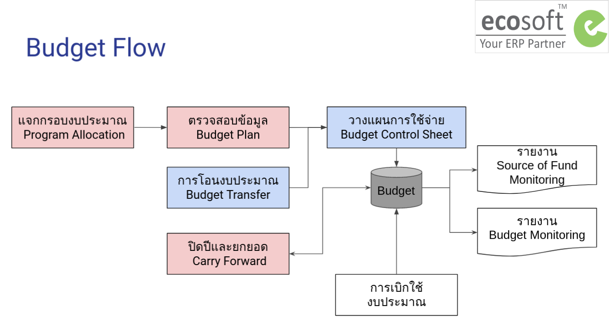

# กระบวนการทำงานของระบบงบประมาณ

**กระบวนการทำงานทั้งหมด มีดังนี้**

1. กระบวนการแจกกรอบงบประมาณ
2. กระบวนการวางแผนการใช้จ่ายงบประมาณ
3. กระบวนการจัดเก็บแผนการใช้จ่ายต้นปี (v.0) และส่งอนุมัติแผนการใช้จ่ายต้นปี (v.1)
4. กระบวนการโอนงบประมาณ
5. กระบวนการปิดปีและยกยอดงบประมาณ

## User Roles

1. Budget Manager: ฝ่ายแผน
      1. เห็นทุกเอกสาร ของทุก Operating Unit
      2. เห็นทุกเมนูการทำงาน 
2. Budget User: พนักงานทั่วไป
      1. เห็นเฉพาะเอกสารของตัวเอง ตาม Operating Unit
      2. เห็นเมนูการทำงาน เฉพาะ 
         1. Budget Control Sheet
         2. Budget Transfer
         3. Budget Monitoring

