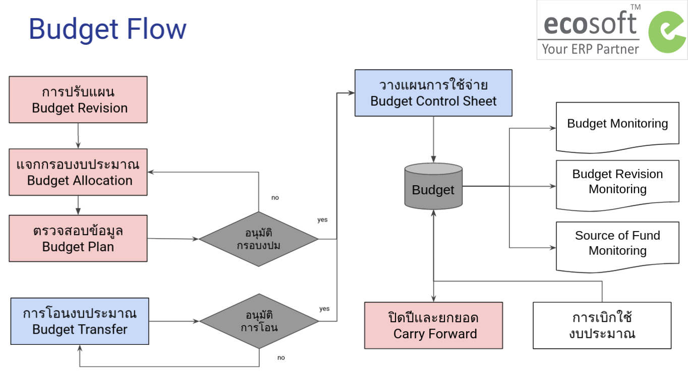

# ระบบบริหารงบประมาณ (Budgeting Management System)

## ภาพรวมกระบวนการทำงาน (Budget Work Flow)

## กระบวนการทำงาน (Budget Process)

1. การสร้างข้อมูลหลัก
2. กระบวนการแจกกรอบงบประมาณ
3. กระบวนการวางแผนการใช้จ่ายงบประมาณ
      - การวางแผนการใช้จ่ายงบประมาณบนExcel
      - การวางแผนการใช้จ่ายงบประมาณบนระบบ
4. กระบวนการการจัดเก็บแผนการใช้จ่ายต้นปี (v.0) และส่งอนุมัติแผนการใช้จ่ายต้นปี (v.1)
5. กระบวนการโอนงบประมาณ
6. กระบวนการปรับแผน
7. กระบวนการปิดปีและยกยอดงบประมาณ

## รายงาน (Budget Monitoring)

1. [Budget Monitoring](1_budget/../monitoring/1_budget_monitoring.md)
2. [Budget Revision Monitoring](1_budget/../monitoring/2_revision_monitoring.md)
3. [Source of Fund Monitoring](1_budget/../monitoring/3_sof_monitoring.md)

## User Roles

1. Budget Manager: ฝ่ายแผน
      1. เห็นทุกเอกสาร ของทุก Operating Unit
      2. เห็นทุกเมนูการทำงาน
2. Budget User: พนักงานทั่วไป
      1. เห็นเฉพาะเอกสารของตัวเอง ตาม Operating Unit
      2. เห็นเมนูการทำงาน เฉพาะ
         1. Budget Control Sheet
         2. Budget Transfer
         3. Budget Monitoring

## Use Case

1. การโอนงบประมาณให้ Cost Center ที่ไม่เคยได้รับการจัดสรรงบประมาณตอนต้นปี