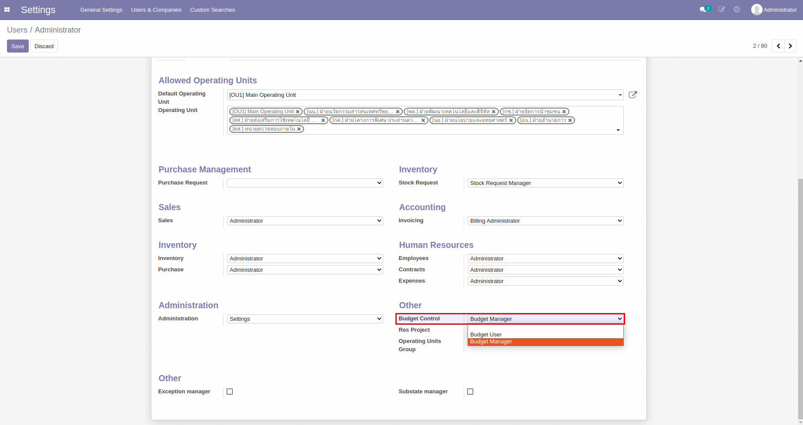
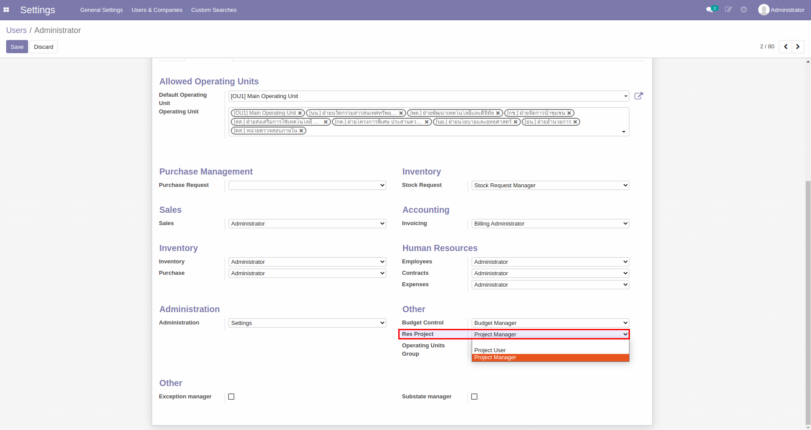
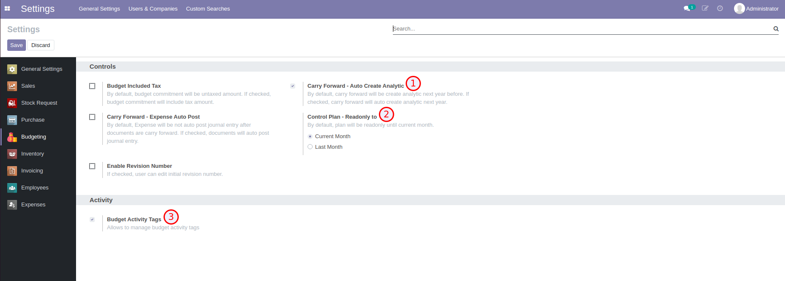

# ระบบบริหารงบประมาณ (Budgeting Management System)

**เอกสารนี้สำหรับ ::** ผู้ดูแลระบบ (System Administrator)

1. การตั้งค่าสิทธิ์สำหรับผู้ใช้งาน
2. การตั้งค่าโมดูล Budgeting

## 1. การตั้งค่าสิทธิ์สำหรับผู้ใช้งาน

**Menu ::** Settings > Users & Companies > Users

- สำหรับพนักงานทั่วไป ต้องมีสิทธิ์เป็น Budget User
- สำหรับพนักงานที่อยู่ในฝ่ายแผน ต้องมีสิทธิ์เป็น Budget Manager และ Project Manager

## 2. การตั้งค่าโมดูล Budgeting

**Menu ::** Settings > Budgeting

1. Carry Forward - Auto Create Analytic: เลือกเพื่อให้ระบบสร้าง Analytic Account ของปีถัดไปให้อัตโนมัติ
2. Control Plan - Readonly to: เลือกว่าต้องการให้ไม่สามารถแก้ไขแผนการใช้จ่ายรายเดือนได้ถึงเดือนไหน
    - Current Month: เดือนปัจจุบัน
    - Last Month: เดือนก่อนหน้า
3. Budget Activity Tags: เลือกเพื่อให้สามารถติด Tag ที่ Activity ได้ ซึ่งการติด Tag จะช่วยในการค้นหา Activity ที่จะใช้ในการสร้างเอกสารขอใช้งบประมาณ เช่น PR, PO, AV, EX

