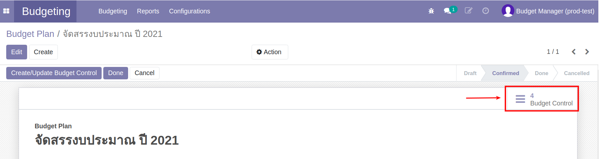
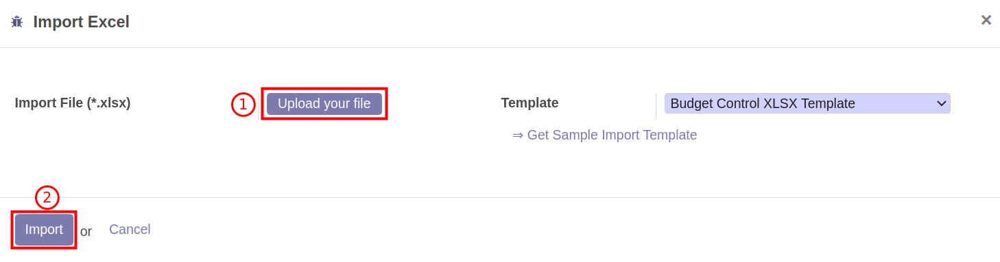
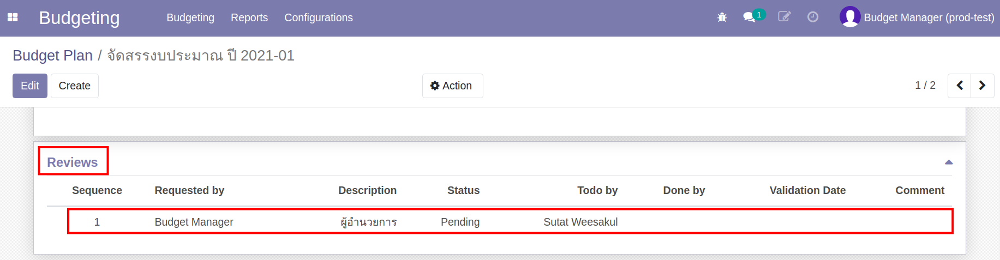
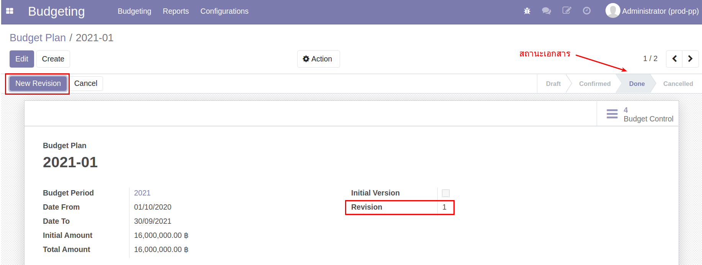
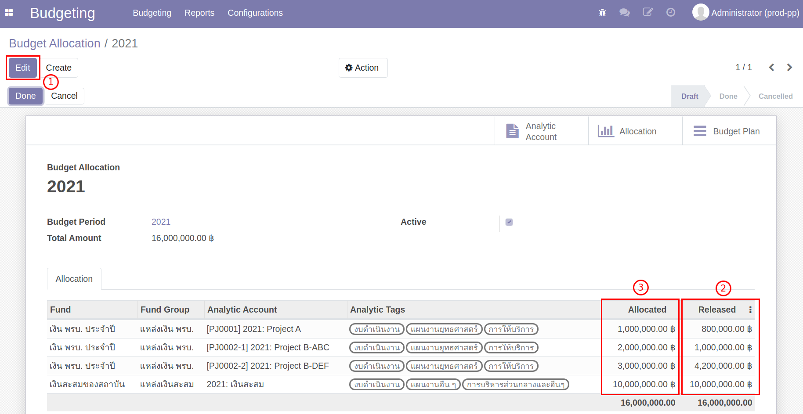
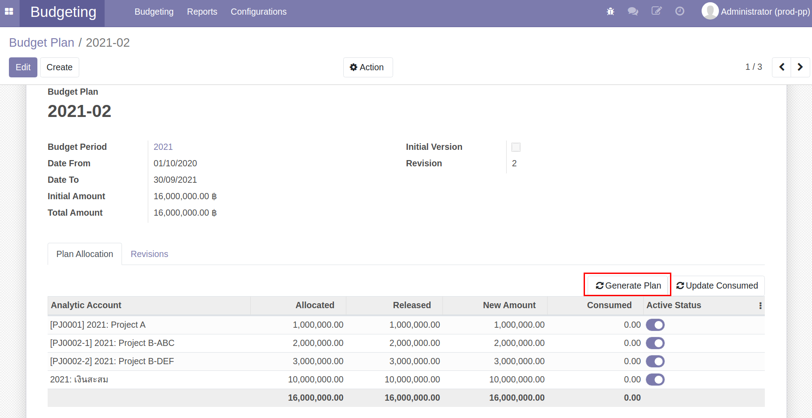
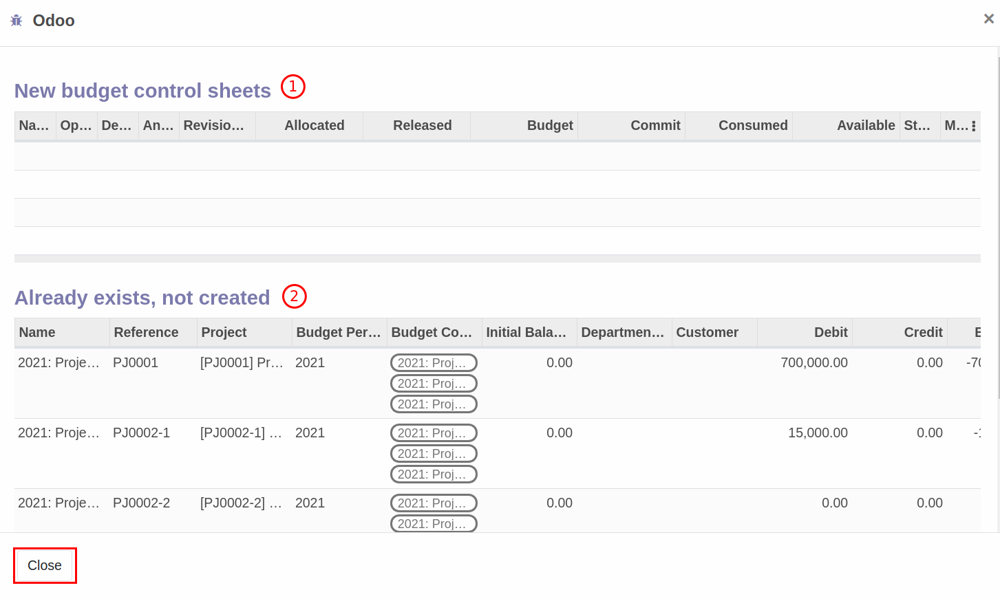

# ระบบบริหารงบประมาณ (Budgeting Management System)

**เอกสารนี้สำหรับ ::** ฝ่ายแผน (Budget Manager)

## การสร้างข้อมูลหลัก (Master Data)

### การสร้างข้อมูลโครงการ (Project)

**Menu ::** Projects > Project

#### การสร้างข้อมูล Project

1. กดปุ่ม "Create" เพื่อสร้าง Project ใหม่ และกรอกรายละเอียด
    1. ชื่อ Project
    2. รหัส Project
    3. Project Manager: ผู้รับผิดชอบ Project
    4. Department: ฝ่ายของ Project นี้ ระบบจะมีค่าเริ่มต้นให้ตาม Project Manager
    5. วันที่เริ่มต้นโครงการ
    6. วันที่สิ้นสุดโครงการ
    7. Member Tab: รายชื่อสมาชิกใน Project

    

2. ตรวจสอบข้อมูลให้ถูกต้องครบถ้วน
    - ถูกต้องครบถ้วน กดปุ่ม "Save" เพื่อบันทึกข้อมูล
    - หากต้องการแก้ไขให้กดปุ่ม "Edit"
  
    **Note** โครงการจะต้องมีสถานะเป็น Draft เท่านั้นจึงจะแก้ไขข้อมูลได้

    

3. กดปุ่ม "Confirm" ระบบจะเปลี่ยนสถานะเป็น Confirmed 

    

#### การสร้าง Project ย่อยภายใต้ Parent Project

1. เลือกโครงการที่ต้องการสร้างโครงการย่อย
    1. กดปุ่ม "Action"
    2. กดปุ่ม "Split Project"

    

2. ระบจะแสดงหน้าต่าง เพื่อสร้างโครงการภายใต้ Parent Project
    1. กดปุ่ม "Add a line" เพื่อสร้างโครงการ
    2. ตั้งชื่อโครงการ
    3. ถูกต้องครบถ้วน กดปุ่ม "Split Project" เพื่อสร้างโครงการ ภายใต้ Parent Project

    

    **สิ้นสุดการสร้าง Project**

### การสร้างข้อมูล Analytic Account จาก Project

**Menu ::** Projects > Project

1. หน้า List view ของ Project
    1. เลือก Project ที่ต้องการสร้าง Analytic Account โดยการคลิกช่องสี่เหลี่ยม
    2. กดปุ่ม "Action"
    3. กดปุ่ม "Create Analytic"

    

!!! Note 
    Project สถานะ  Confirmed เท่านั้นถึงจะสามารถสร้าง Analytic Account ได้

2. ระบบแสดงหน้าต่าง
    1. Budget Period: เลือกปีงบประมาณของ Analytic Account
    2. กดปุ่ม "Create Analytic Account"
    

3.  ระบบจะสร้างและไปยังหน้า Analytic Account

    

4.  สิ้นสุดกระบวนการสร้าง Project และ Analytic Account

!!! Note
    Analytic Account จากฝ่าย (Department) จะถูกสร้างขึ้นอัตโนมัติ

### การสร้างข้อมูลแหล่งงบประมาณ (Source of Fund)

**Menu ::** Budgeting > Configurations  > Source of Fund

1. กดปุ่ม "Create" เพื่อสร้าง Source of Fund ใหม่ และกรอกรายละเอียด
    1. ตั้งชื่อแหล่งทุน
    2. เลือกกลุ่มของแหล่งทุน
    3. ตารางแสดงเงื่อนไขการกำหนดแหล่งทุน (Fund Constraint) ระบบจะแสดงให้อัตโนมัติ จากการทำงานที่หน้า Program Allocation
    4. Objective: วัตถุประสงค์ของแหล่งทุน (ถ้ามี)

    

2. ตรวจสอบข้อมูลให้ถูกต้องครบถ้วน
    - ถูกต้องครบถ้วน กดปุ่ม "Save" เพื่อบันทึกข้อมูล
    - หากต้องการแก้ไขให้กดปุ่ม "Edit"

    **สิ้นสุดกระบวนการสร้าง Source of Fund**

### การสร้างข้อมูลกลุ่มงบประมาณ (Program)

**Menu ::** Budgeting > Configurations > Program

1. กดปุ่ม "Create" เพื่อสร้างข้อมูล Program
    1. ตั้งชื่อ Program
    2. ตั้งรหัส Program (ถ้ามี)

    

2. ตรวจสอบข้อมูลให้ถูกต้องครบถ้วน
    - ถูกต้องครบถ้วน กดปุ่ม "Save" เพื่อบันทึกข้อมูล
    - หากต้องการแก้ไขให้กดปุ่ม "Edit"

### การสร้างข้อมูลแผนงาน (Work Plan)

**Menu ::** Budgeting > Configurations > Work Plan

1. กดปุ่ม "Create" เพื่อสร้างข้อมูล Work Plan
    1. ตั้งชื่อ Work Plan
    2. ตั้งรหัส Work Plan (ถ้ามี)

    

2. ตรวจสอบข้อมูลให้ถูกต้องครบถ้วน
    - ถูกต้องครบถ้วน กดปุ่ม "Save" เพื่อบันทึกข้อมูล
    - หากต้องการแก้ไขให้กดปุ่ม "Edit"

### การสร้างข้อมูลประเภทงบประมาณ (Budget Type)

**Menu ::** Budgeting > Configurations > Budget Type

1. กดปุ่ม "Create" เพื่อสร้างข้อมูล Budget Type
    1. ตั้งชื่อ Budget Type
    2. ตั้งรหัส Budget Type (ถ้ามี)

    

2. ตรวจสอบข้อมูลให้ถูกต้องครบถ้วน
    - ถูกต้องครบถ้วน กดปุ่ม "Save" เพื่อบันทึกข้อมูล
    - หากต้องการแก้ไขให้กดปุ่ม "Edit"

## การแจกกรอบงบประมาณ (Budget Allocation)

ขั้นตอนการแจกกรอบงบประมาณ มีดังนี้

1. แจกกรอบงบประมาณตามแผนงาน, กลุ่มงบประมาณ และ ประเภทงบประมาณ (Budget Allocation)
2. ตรวจสอบข้อมูลการแจกกรอบงบประมาณ ในมุมมอง Analytic Account (Budget Plan)

ขั้นตอนการทำงาน

### แจกกรอบงบประมาณตามแผนงาน, กลุ่มงบประมาณ และ ประเภทงบประมาณ (Budget Allocation)

**Menu ::** Budgeting > Budgeting > Budget Allocation

กดปุ่ม "Create" เพื่อสร้างการแจกกรอบงบประมาณ (Budget Allocation)

1. ตั้งชื่อเอกสารสำหรับการแจกกรอบงบประมาณ
2. Budget Period: เลือกปีงบประมาณ
3. Add a line: เพื่อแจกรอบงบประมาณที่ละบรรทัด โดยเลือกข้อมูล ดังนี้
    * แหล่งทุน (Fund) ระบบจะแสดงกลุ่มของแหล่งทุน (Fund Group) ให้อัตโนมัติ
    * Analytic Account 
    * Analytic tags (กลุ่มงบประมาณ, แผนงาน, ประเภทงบประมาณ)
    * Allocated จำนวนเงินงบประมาณที่จัดสรรให้ข้อมูลบรรทัดนั้น
4. เมื่อจัดสรรงบประมาณครบถ้วนแล้ว กด "Save" เพื่อบันทึกข้อมูล และตรวจสอบความถูกต้องอีกครั้ง สถานะเอกสารยังคงเป็น Draft
    * ถ้าต้องการแก้ไข กด “Edit”
    * ถ้าข้อมูลถูกต้องครบถ้วน ยืนยันการจัดสรรงบประมาณ กด "Done" สถานะเอกสารเปลี่ยนจาก Draft เป็น Done

    

5. ระบบแสดงปุ่ม "Generate Budget Plan" กดเพื่อสร้างเอกสาร Budget Plan
 
    

สิ้นสุดการทำงานที่หน้า Budget Allocation

### ตรวจสอบข้อมูลการแจกกรอบงบประมาณ ในมุมมอง Analytic Account (Budget Plan)

ระบบสร้าง Budget Plan สถานะเอกสารอยู่ที่ To Verify รอหัวหน้างานยุทธศาสตร์แผนงานและงบประมาณ Verify

หลังจากหัวหน้างานยุทธศาสตร์แผนงานและงบประมาณ Verify เสร็จแล้วสถานะเอกสารอยู่ Confirmed

**Menu ::** Budgeting > Budgeting > Budget Plan

เลือก Budget Plan ที่สร้างจาก Budget Allocation

1. ตรวจสอบข้อมูลตาม Analytic Account
2. กดปุ่ม "Create/Update Budget Control" เพื่อสร้าง Budget Control Sheet
    
    

    ระบบแสดงหน้าต่างแสดงการสร้าง Budget Control Sheet กดปุ่ม "Close"
    

3. ตรวจสอบข้อมูล Budget Control Sheet ที่สร้าง

    

4. หากถูกต้องครบถ้วน กลับมาที่ Menu :: Budget Plan กดปุ่ม "Done" เพื่อสิ้นสุดขั้นตอนการแจกกรอบงบประมาณ
    สถานะเอกสารเปลี่ยนจาก Confirmed > Done

สิ้นสุดการทำงานที่หน้า Budget Plan

### ขั้นตอนการพิ่ม Analytic Tags หลังจากที่มีการแจกกรอบงบประมาณไปแล้ว

!!! Tip "สำหรับ Use Cases"
    * (1) การโอนงบประมาณให้ Cost Center ที่ไม่เคยได้รับการจัดสรรงบประมาณตอนต้นปี

**Menu ::** Budgeting > Budgeting > Budget Allocation

1. ที่เมนู Budget Allocation ตรวจสอบสถานะของเอกสาร จะอยู่ที่ Confirmed
    1. กดปุ่ม "Set to draft" เพื่อเปลี่ยนสถานะเอกสารจาก Confirmed เป็น Draft
    2. กดปุ่ม "Edit" เพื่อใส่ Analytic Tags
    

2. กด "Add a line" เพื่อเพิ่ม Analytic Tags ให้กับ Cost Center ที่ยังไม่เคยมี Analytic Tags
    1. เลือก Fund
    2. เลือก Analytic Account
    3. เลือก Analytic Tags
    

3. กดปุ่ม "Save" ตรวจสอบข้อมูล
    - ถูกต้องครบถ้วน กดปุ่ม "Done" เพื่อเปลี่ยนสถานะเอกสารจาก Draft เป็น Done
    - หากต้องการแก้ไข กดปุ่ม "Edit"

สิ้นสุดการเพิ่ม Analytic Tags 

## กระบวนการวางแผนการใช้จ่ายงบประมาณ

### การ Export Budget Control Sheet เพื่อให้พนักงานทั่วไปวางแผนการใช้จ่ายงบประมาณ

**Menu ::** Budgeting > Budgeting > Budget Control Sheet

1. เลือก Budget Control Sheet ที่ต้องการ เพื่อ Export เอกสารให้พนักงานทั่วไปวางแผนการใช้จ่ายงบประมาณ
2. กดปุ่ม "Action"
3. กดปุ่ม "Export Excel" เพื่อ Export Budget Control Sheet ทั้งหมดที่เลือกในข้อ 1.

    

4. ระบบแสดงหน้าต่าง ดังนี้

    

5. หลังจากกด Export ระบบแสดงหน้าต่าง กดที่ "file.zip" เพื่อดาวน์โหลด ไฟล์ Excel Budget Control Sheet ทั้งหมดที่เลือกในข้อ 1

    

!!! Note 
    ฝ่ายแผน ส่ง Excel File ให้พนักงานทั่วไปของสสน. วางแผนการใช้จ่าย เมื่อได้รับ Excel File ที่วางแผนการใช้จ่ายงบประมาณเสร็จสิ้น

!!! Note
    **ตัวอย่างการวางแผนใน Excel file**
    
    ตรวจสอบยอดรวมของเงินที่วางแผน จะต้องเท่ากับ Released (ยอดเงินที่ใช้ได้ปัจจุบัน)

### การ Import Excel Budget Control Sheet เข้าระบบ

**Menu ::** Budgeting > Budgeting > Budget Control Sheet

!!! Note
    เมื่อได้รับ Excel file แผนการใช้จ่ายงบประมาณจากพนักงานทั่วไป ตรวจสอบข้อมูล ความถูกต้อง และเริ่มนำ excel file เข้าระบบ

เลือก Budget Control Sheet ที่ต้องการ Import เข้าระบบ

1. กดปุ่ม "Action"
2. กดปุ่ม "Import Excel" เพื่อนำไฟล์ excel เข้าระบบ
    
3. ระบบแสดงหน้าต่าง ดังนี้
      1. กดปุ่ม "Upload your file"
      2. กดปุ่ม "Import"
    
4. เมื่อ Import ข้อมูลสำเร็จ ระบบจะแสดงหน้าต่าง กดปุ่ม "Close" เพื่อดูข้อมูลที่หน้า Budget Control Sheet
    

!!! Note 
    เมื่อ Import สำเร็จ ที่หน้า Budget Control Sheet จะมีข้อมูลเหมือนใน Excel File
    

เมื่อ Import Excel จนครบทุก Budget Control Sheet เริ่มขั้นตอนจัดเก็บแผนการใช้จ่ายต้นปี (v.0) และส่งอนุมัติแผนการใช้จ่ายต้นปี (v.1)

## กระบวนการการจัดเก็บแผนการใช้จ่ายต้นปี (v.0) และส่งอนุมัติแผนการใช้จ่ายต้นปี (v.1)

**Menu ::** Budgeting > Budgeting > Budget Control Sheet

1. กดเพื่อเลือก Budget Control Sheet สถานะ Draft ทั้งหมด
2. กดปุ่ม "Action"
3. กดปุ่ม "Cancel" จะได้ Budget Control Sheet สถานะ Cancelled
    
        
**Menu ::** Budgeting > Budgeting > Budget Plan

1. เลือก Budget Plan (Revision 0) ที่สร้างจาก Budget Allocation ตอนต้นปี สถานะเอกสารอยู่ที่ Done
      - กดปุ่ม "New Revision" 
        
2. ระบบจะสร้าง Budget Plan (Revision 1) สถานะเอกสารอยู่ที่ Draft (เจ้าหน้าที่แผนจะทำรายการต่อไม่ได้จนกว่าจะได้รับการ Verify จากหัวหน้างานยุทธศาสตร์แผนงานและงบประมาณ)
      - เมื่อได้รับการ Verify เสร็จแล้วระบบจะส่งเอกสารสู่ขั้นตอนการอนุมัติโดย ผสสน.
        

      - ระบบจะแสดงที่ Tab "Reviews" แสดงลำดับและสถานะการอนุมัติ
        

    !!! Note 
        หากได้รับการอนุมัติแล้ว ระบบจะเปลี่ยนสถานะเอกสารจาก Draft เป็น Confirmed
        

3. หลังจากได้รับการอนุมัติกรอบงบประมาณ กดปุ่ม "Create/Update Budget Control"

    

4. ระบบจะเก็บแผนการใช้จ่าย Budget Control Sheet v.0 และสร้าง Budget Control Sheet v.1
      1. กดเพื่อเลือก Budget Control Sheet ทั้งหมด
      2. กดปุ่ม "Action"
      3. กดปุ่ม "Control" เพื่อเริ่มการใช้จ่ายงบประมาณ
    

5. หลังจาก "Control" Budget Control Sheet Revision 1 เสร็จสิ้น 
6. กลับมาที่ Menu :: Budget Plan กดปุ่ม "Done" เพื่อเปลี่ยนสถานะเอกสารจาก Confirmed เป็น Done เพื่อสิ้นสุดการทำงานของฝ่ายแผน

## กระบวนการปรับแผน

กระบวนการปรับแผนในระบบ จะทำการปรับกรอบงบประมาณของทั้งระบบให้เป็นไปตามกรอบงบประมาณใหม่ที่ต้องการจัดสรร

### รายงาน Budget Revision Monitoring

สามารถดูรายงานที่ **Menu ::** Budgeting > Reporting > Budget Revision Monitoring

### ขั้นตอนการปรับแผนงบประมาณ

**Menu ::** Budgeting > Budgeting > Budget Plan

1. เลือกเอกสาร Budget Plan Version ปัจจุบัน
    

2. เอกสารจะแสดง Revision ปัจจุบันอยู่ที่ 1 และสถานะเอกสารอยู่ที่ Done กดปุ่ม "New Revision"
    

3. ระบบสร้าง Budget Plan Version ใหม่
    

4. ไปที่ **Menu ::** Budgeting > Budgeting > Budget Allocation เพื่อแก้ไขกรอบงบประมาณใหม่ตามกรอบงบประมาณที่ได้รับการอนุมัติจากการประชุม
    - กดปุ่ม "Reset to draft" เพื่อเริ่มแก้ไขกรอบงบประมาณ
    

5. เริ่มการแก้ไขกรอบงบประมาณ
    1. กดปุ่ม "Edit"
    2. Release: แสดงกรอบงบประมาณปัจจุบัน ที่เปลี่ยนแปลงตามการโอนงบประมาณ
    3. Allocate: *แก้ไขกรอบงบประมาณใหม่* ที่ต้องการปรับแผน
    4. ในกรณีที่ต้องการเพิ่มโครงการ สามารถกดปุ่ม "Add a line" และเริ่มแจกกรอบเพิ่มเติม
    

6. กด "Save" เพื่อบันทึกข้อมูล หากถูกต้องครบถ้วน กด "Done" สถานะเอกสารเปลี่ยนจาก Draft เป็น Done 

7. กลับมาที่ **Menu ::** Budgeting > Budgeting > Budget Plan
    - กดปุ่ม "Generate Plan"
    
    - ระบบจะอัพเดตข้อมูลกรอบงบประมาณใหม่ที่แก้ไขในหน้า Budget Allocaiton
        - ถูกต้องครบถ้วน สถานะเอกสารอยู่ที่ To verify แจ้งหัวหน้างานยุทธศาสตร์แผนงานและงบประมาณเพื่อทำการ Verify และส่งอนุมัติ
        - หากต้องการแก้ไข จะต้องการไปแก้ที่หน้า Budget Allocation ตามข้อ 4-6
    

8. เมื่อได้รับการอนุมัติ เรียบร้อยแล้ว
    - ไปที่ **Menu ::** Budgeting > Budgeting > Budget Control Sheet
        1. เลือก Budget Control Sheet ทั้งหมด
        2. กดปุ่ม "Action"
        3. กดปุ่ม "Cancel" เพื่อหยุดการใช้งบประมาณ Version ปัจจุบัน
        

    - ไปที่ **Menu ::** Budgeting > Budgeting > Budget Plan
      1. สถานะเอกสารจะเปลี่ยนจาก Draft เป็น Confirmed
      2. กดปุ่ม "Create/Update Budget Control" เพื่อสร้าง Budget Control Sheet Version ใหม่
        

9. ระบบแสดงหน้าต่าง
    1. หากมีโครงการเพิ่มขึ้น ระบบจะแสดงการสร้าง Budget Control Sheet
    2. แสดงการอัพเดต Budget Control Sheet Version ใหม่
    

10. กดปุ่ม "Done" เพื่อสิ้นสุดการปรับแผน สถานะเอกสารเปลี่ยนจาก Confirmed เป็น Done
    

#### การขยายเวลา Analytic Account ที่ถูก Extend

!!! Tip "สำหรับ Use Cases"
    * (2) การขยายเวลาดำเนินโครงการ Analytic Account ที่ถูก Extend

กรณีที่ต้องการขยายเวลาการดำเนินโครงการของ Analytic Account ที่ Extend หลังขั้นตอนการปิดปีงบประมาณ

**Menu ::** Budgeting > Configuration > Analytic Accounts

1. เลือก Analytic Accounts ที่ต้องการขยายเวลา
    1. กดปุ่ม "Edit"
    2. ขยายระยะเวลาที่ช่อง Date to
   

2. ตรวจสอบข้อมูล ถูกต้องครบถ้วน กดปุ่ม "Save" เพื่อบันทึกข้อมูล

## กระบวนการปิดปีและยกยอดงบประมาณ

ขั้นตอนการทำกระบวนการปิดปีและยกยอดงบประมาณ มีดังนี้

1. หยุดการใช้งบประมาณบนระบบ
2. การสร้างเอกสาร Budget Carry Forward
3. ตรวจสอบข้อมูลเอกสาร Budget Carry Forward และยกยอดงบประมาณ

### ขั้นตอนการหยุดใช้งบประมาณบนระบบ

เข้าระบบเพื่อหยุดการใช้งบประมาณทั้งหมด โดยทำตามขั้นตอน ดังนี้

**Menu ::** Budgeting > Budgeting > Budget Control Sheet

1. เข้าไปที่หน้า Budget Control Sheet และเลือก Budget Control Sheet ทั้งหมด
2. กดปุ่ม Action 
3. กดปุ่ม Cancel เพื่อเปลี่ยนสถานะเอกสารเป็น Cancel เพื่อหยุดการใช้งบประมาณ

## ขั้นตอนการสร้างเอกสาร Budget Carry Forward

**Menu ::** Budgeting > Budgeting > Budget Carry Forward

1. กดปุ่ม "Create" เพื่อสร้างเอกสาร
    

2. กรอกข้อมูลในเอกสาร Budget Carry Forward 
    1. Name: ชื่อเอกสาร
    2. To Budget Period: ปีงบประมาณที่ต้องการยกยอดไป
    3. Method: วิธีการยกยอด
        - Extend: ขยายเวลาการใช้จ่ายงบประมาณ
        - New Analytic: ยกยอดไป Analytic Account ใหม่
    4. Accumulated Analytic Account: Analytic Account สำหรับเก็บเงินสะสม

    

3. ตรวจสอบข้อมูล
    - หากถูกต้องครบถ้วนกดปุ่ม "Save"
    - หากต้องการแก้ไขกดปุ่ม "Edit"

การยกยอดข้ามปี แบ่งออกเป็น 2 แบบ ดังนี้

1. ยกยอด Commitment
2. ยกยอด เงินคงเหลือ

ซึ่งในแต่ละแบบมีขั้นตอนการทำงาน ดังนี้

#### 1. ยกยอด Commitment

การยกยอด Commitment คือ การยกยอดค่าใช้จ่ายที่มีการของบประมาณไปแล้ว แต่ยังไม่ได้จ่ายจริง

1. ไปที่ Tab ของเอกสารที่ต้องการยกยอด
    - Purchase Request
    - Purchase
    - Advance
    - Expense
2. กดปุ่ม List purchase request commitment (ชื่อปุ่มจะเปลี่ยนตาม Tab ที่เลือก)
3. ระบบจะดึงข้อมูลค่าใช้จ่ายที่มีการจองงบประมาณไปแล้ว แต่ยังไม่ได้จ่ายจริงมาแสดง

    

4. ทำข้อ 1-3 จนครบทุก Tab
5. ตรวจสอบข้อมูล
    - หากถูกต้องครบถ้วนกดปุ่ม "Save"
    - หากต้องการแก้ไข กดปุ่ม "Edit"

#### 2. ยกยอด เงินคงเหลือ

การยกยอดเงินคงเหลือ คือ การยกยอดงบประมาณที่ไม่มีการขอใช้

1. ไปที่ Tab Available
2. กดปุ่ม List analytic account
3. ระบบจะดึงข้อมูล Analytic Account ที่มีเงินคงเหลือมาแสดง

    

4. กดปุ่ม "Edit" เพื่อแก้ไขข้อมูล
    1. Analytic Account
    2. Method: วิธีการยกยอด
        - Extend: ขยายเวลาการใช้จ่ายงบประมาณ
        - New Analytic: ยกยอดไป Analytic Account ใหม่
    3. Extend Date: วันที่ต้องการขยาย
    4. Available: ยอดเงินคงเหลือของ Analytic Account
    5. Carry Forward Analytic Account: Analytic Account ที่ต้องการยกยอดไปไว้ใช้จ่าย
    6. Carry Forward Amount: ยอดเงินที่ต้องการยกยอดไปไว้ใช้จ่าย
    7. Accumulate Analytic Account: Analytic Account ที่ต้องการยกยอดไปเก็บสะสม
    8. Accumulated Amount: ยอดเงินที่ต้องการยกยอดไปเก็บสะสม

    

    ตัวอย่างการยกยอดงบประมาณ
    1. การยกยอดโครงการที่มีระยะเวลาดำเนินโครงการมากกว่า 1 ปี โดยยกเงินคงเหลือไปทำโครงการต่อในปีถัดไป
    2. การขยายระยะเวลาการดำเนินโครงการ
    3. การยกเงินคงเหลือทั้งหมดไปเก็บที่ Analytic Account เงินสะสม โดยที่ไม่มีการดำเนินโครงการต่อในปีงบประมาณถัดไป

    

    !!! Note
        ในแต่ละบรรทัดระบบจะดึง default ของ Method กับ Accumulate Analytic Account จากด้านบนเอกสาร

    !!! Note
        ถ้าเลือก Method เป็น Extend ไม่ต้องเลือก Carry Forward Analytic Account แต่ถ้าเลือก Method เป็น New Analytic ต้องเลือก Carry Forward Analytic Account

5. ตรวจสอบข้อมูล
    - หากถูกต้องครบถ้วนกดปุ่ม "Save"
    - หากต้องการแก้ไข กดปุ่ม "Edit"

!!! Note
    กรณีเลือก Method เป็น New Analytic แล้วต้องการให้ระบบช่วยใส่ Carry Forward Analytic Account ให้สามารถใช้การกดปุ่ม "Prepare carry forward analytic account" ได้
    

### ขั้นตอนการตรวจสอบข้อมูลเอกสาร Budget Carry Forward และยกยอดงบประมาณ

**Menu ::** Budgeting > Budgeting > Budget Carry Forward

หลังจากผ่านการ Verify จากหัวหน้างานยุทธศาสตร์แผนงานและงบประมาณ สถานะเอกสารเปลี่ยนจาก To Verify เป็น Verify
    
ทำการยกยอดงบประมาณต่อ ดังนี้
1. เลือกเอกสาร Budget Carry Forward ที่ต้องการ
2. กดปุ่ม "Carry Budget Forward"

4. ระบบแสดงหน้าต่างให้ตรวจสอบตัวเลขการยกยอดงบประมาณอีกครั้ง
    1. หากถูกต้องครบถ้วน กดปุ่ม "Carry Budget Forward" เพื่อยกยอดงบประมาณ
    2. หากต้องการแก้ไข กดปุ่ม "Cancel"
    

### วิธีการดูรายงานหลังจากทำ Budget Carry Forward เสร็จสิ้น

1. รายละเอียดแสดง Commitment ทั้งหมด สามารถดูได้ที่ Budget Monitoring
    

2. ยอดรวมทั้งหมดที่ยกไปในปีงบประมาณถัดไป สามารถดูได้ที่หน้า Analytic Account ที่คอมลัมน์ Initial Amount จะแสดงถึง ยอดคงเหลือยกมา และ Commitment
    