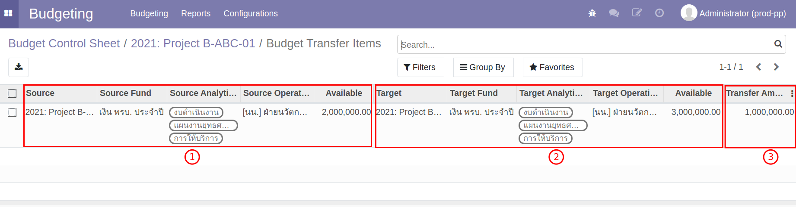
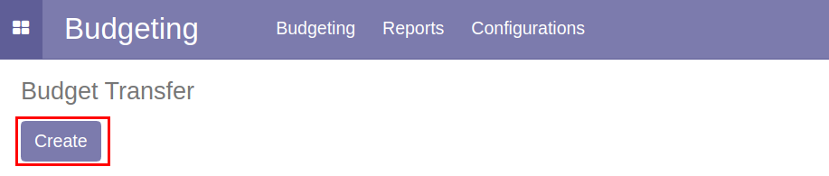
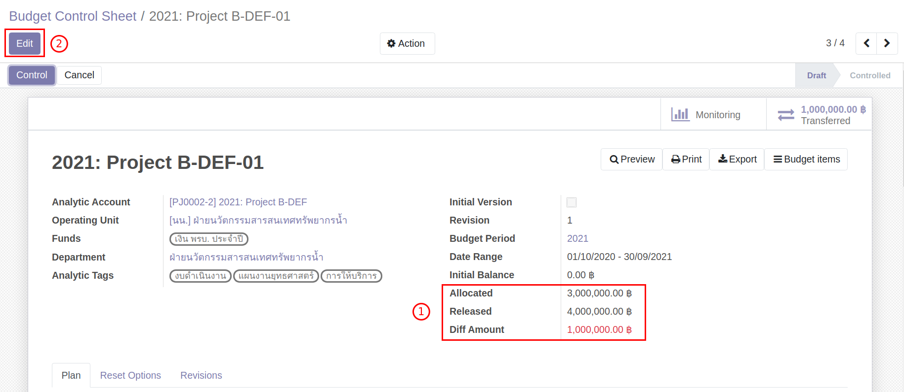

# ระบบบริหารงบประมาณ (Budgeting Management System)

**เอกสารนี้สำหรับ ::** พนักงานทั่วไป (Budget User)

## กระบวนการวางแผนการใช้จ่ายงบประมาณ

### การวางแผนการใช้จ่ายงบประมาณบน Excel

หลังจากที่ฝ่ายแผน ทำการสร้างงบประมาณในระบบแล้ว ทางฝ่ายแผน จะส่งไฟล์ Excel ให้กับผู้รับผิดชอบงบประมาณตาม Analytic Account ซึ่งผู้รับผิดชอบจะต้องทำการวางแผนงบประมาณของปีนั้น ๆ ให้ถูกต้อง ครบถ้วนตามงบประมาณที่ได้รับ

รายละเอียดการกรอกข้อมูลการวางแผนบน Excel

1. เลือก Activity Group: กิจกรรมที่ผู้ใช้งานต้องการวางแผนการใช้จ่ายงบประมาณ
2. กรอกตัวเลข ตามแผนการที่วางไว้ตามแต่ละเดือน 
3. ยอดรวมงบประมารที่วางแผน (N:7) จะต้องเท่ากับ Released (K:4)

!!! Note 
    การ Copy ข้อมูลจากที่อื่นมาลงใน Excel จะต้องระวังเรื่องตัวอักษร การเว้นวรรค และอื่น ๆ ที่อาจะทำให้ชื่อที่ copy มากับในระบบไม่ตรงกัน แล้วระบบจะไม่สามารถ Import ข้อมูลนั้นเข้าไปได้

ตรวจสอบยความถูกต้องของไฟล์ Excel จากนั้น Save > **ส่งไฟล์ Excel ให้กับฝ่ายแผน**

**สิ้นสุดการกรอกข้อมูลการวางแผนใน Excel**

### การวางแผนการใช้งบประมาณบนระบบ

**Menu ::** Budgeting > Budgeting > Budget Control Sheet

1. เลือก Budget Control Sheet ที่ต้องการวางแผนงบประมาณ
2. กดปุ่ม "Edit" เพื่อแก้ไขข้อมูล
    1. ไปที่ Tab Reset Options: ใช้สำหรับการควบคุมการสร้าง Activity Group
    2. เลือก Activity Group ทั้งหมดที่ต้องการวางแผนการใช้จ่ายงบประมาณ
    3. ตรวจสอบข้อมูล ถูกต้องครบถ้วน กด "Save"

    

3. วางแผนการใช้จ่ายลงในตาราง ซึ่งมีขั้นตอนดังนี้
    1. ไปที่ Tab Plan
    2. กดปุ่ม "Reset Plan" เพื่อให้ระบบสร้างข้อมูลสำหรับการวางแผนการใช้จ่ายงบประมาณ
    3. กดปุ่ม "Edit" เพื่อที่จะสามารถแก้ไขตัวเลขข้อมูลการวางแผนได้
    4. กรอกตัวเลข วางแผนการใช้จ่ายลงในตาราง

    

4. ตรวจสอบยอดรวมของเงินที่วางแผน จะต้องเท่ากับ Released (ยอดเงินที่ใช้ได้ปัจจุบัน)
    

5. หากต้องการเพิ่ม Activity Group
    1. ไปที่ Tab Reset Options
    2. เลือก Activity Group ที่ต้องการเพิ่ม
    3. ไปที่ Tab Plan จากนั้นกดปุ่ม "Refresh"

6. ตรวจสอบข้อมูล ถูกต้องครบถ้วน 
    1. กด "Save" เพื่อบันทึกข้อมูล
    2. หากต้องการแก้ไข กดปุ่ม "Edit"

!!! Note "Smart Button บน Budget Control Sheet"
    ที่หน้า Budget Control Sheet (Form View) จะมี Smart Button 2 ปุ่ม
    

    1. **Monitoring:** แสดงการใช้จ่ายงบประมาณ
    

    2. **Transferred:** แสดงรายละเอียดการโอนงบประมาณที่เกิดขึ้น
        1. รายละเอียดของผู้โอนงบประมาณ
        2. รายละเอียดผู้รับงบประมาณ
        3. ยอดงบประมาณที่ถูกโอน

    

------------------------------

## กระบวนการโอนงบประมาณ

ผู้ให้และผู้รับงบประมาณ มีการตกลงกันว่าต้องการโอนงบประมาณ จากนั้นจึงเริ่มการทำงานในระบบ โดยเริ่มจาก

1. หยุดการใช้งบประมาณบนระบบ
2. การสร้างเอกสาร Budget Transfer
3. แก้ไขแผนการใช้จ่าย หลังจากโอนงบประมาณเสร็จสิ้น

### การหยุดใช้งบประมาณบนระบบ

ทั้งผู้ให้และผู้รับงบประมาณ เข้าระบบเพื่อหยุดการใช้งบประมาณของตนเอง โดยทำตามขั้นตอน ดังนี้

**Menu ::** Budgeting > Budgeting > Budget Control Sheet

1. เข้าไปที่หน้า Budget Control Sheet ของตนเอง ระบบแสดงสถานะของ Budget Control Sheet เป็น Control
2. กดปุ่ม Reset to Draft เปลี่ยนสถานะเอกสารจาก Control เป็น Draft เพื่อหยุดการเบิกใช้งบประมาณ
    

### การสร้างเอกสาร Budget Transfer

**Menu ::** Budgeting > Budgeting > Budget Transfer

1. กดปุ่ม "Create" เพื่อสร้างเอกสาร
    

2. กดปุ่ม "Add a line" เพื่อกรอกรายละเอียด ดังนี้
    1. Source: เลือกผู้ให้งบประมาณ
    2. Source Analytic Tags: เลือก Tags ที่มี โดยระบบจะดึงค่าตั้งต้นให้ หาก Analytic Account นั้นมี Tags อย่างละ 1 ตัว
    3. Source Fund: แหล่งงบประมาณ
    4. Available: ยอดงบประมาณคงเหลือ
    5. Target: ผู้รับงบประมาณ
    6. Target Analytic Tags: Analytic Tags: เลือก Tags ที่มี โดยระบบจะดึงค่าตั้งต้นให้ หาก Analytic 
    7. Target Fund: แหล่งงบประมาณ
    8. Available: ยอดงบประมาณคงเหลือ
    9. **Transfer Amount: ยอดงบประมาณที่ต้องการโอน**
        

3. ตรวจสอบข้อมูล หากถูกต้องครบถ้วนกดปุ่ม "Save" หากต้องการแก้ไขกดปุ่ม "Edit"
4. กดปุ่ม "Submit" ระบบจะส่งเอกสารเพื่อขออนุมัติการโอนงบประมาณ
    - สถานะเอกสารเปลี่ยนจาก Draft เป็น Submit
        
    - Tab Review จะแสดงสถานะการอนุมัติ
        

    !!! Note
        หากฝ่ายแผนพิจารณาให้โอนงบประมาณได้ ระบบจะส่งเอกสารอนุมัติตามลำดับ
        

5. เมื่อได้รับการอนุมัติครบถ้วนแล้ว เอกสารจะเปลี่ยนสถานะจาก Sunmitted เป็น Transfered
    

!!! Note
    หากยังไม่มี Analytic Tags ในระบบ ให้แจ้งฝ่ายแผนให้ใส่ Analytic Tags ในระบบ

!!! Tip "สามารถใช้กับ Use Cases"
    * (3) การโอนเงินออกจาก Analytic Account ที่ถูก Extend

### การแก้ไขแผนการใช้จ่าย หลังจากโอนงบประมาณเสร็จสิ้น

เมื่อทำการโอนงบประมาณเสร็จสิ้น ทั้งผู้ให้และผู้รับงปบระมาณ จะต้องวางแผนการใช้จ่ายใหม่ ตามกรอบงบประมาณที่เปลี่ยนแปลงไปจากการโอนงบประมาณ

**Menu ::** Budgeting > Budgeting > Budget Control Sheet

**ผู้ให้งบประมาณ**

1. ผู้ให้งบประมาณ เมื่อโอนงบประมาณสำเร็จ กรอบงบประมาณ Release จะลดลงตามยอดงบประมาณที่โอน
    - Allocate: กรอบงบประมาณที่ได้รับการจัดสรรจากฝ่ายแผน
    - Release: กรอบงบประมาณล่าสุด
    - Diff: ผลต่างระหว่าง Release กับ ผลรวมงบประมาณที่วางแผนในปัจจุบัน

2. กดปุ่ม "Edit" เพื่อวางแผนการใช้จ่ายงบประมาณใหม่
    

!!! Note
    ระบบไม่อนุญาติให้วางแผนการใช้จ่ายเดือนในอดีต
    หากวางแผนการใช้จ่ายส่วนใหญ่อยู่ในอดีตจะไม่สามารถแก้ไขได้ ให้วางแผนแบบ ติดลบ เพื่อให้ผลรวมงบประมาณเท่ากับ Release

3. เมื่อแก้ไขแผนการใช้จ่ายเสร็จสิ้น กดปุ่ม "Save" เพื่อบันทึกข้อมูล
4. กดปุ่ม "Submit" และ "Control" เพื่อเริ่มการใช้จ่ายงบประมาณอีกครั้ง

**ผู้รับงบประมาณ**

1. ผู้รับงบประมาณ เมื่อโอนงบประมาณสำเร็จ กรอบงบประมาณ Release จะเพิ่มขึ้นตามยอดงบประมาณที่โอน
    - Allocate: กรอบงบประมาณที่ได้รับการจัดสรรจากฝ่ายแผน
    - Release: กรอบงบประมาณล่าสุด
    - Diff: ผลต่างระหว่าง Release กับ ผลรวมงบประมาณที่วางแผนในปัจจุบัน

2. กดปุ่ม "Edit" เพื่อวางแผนการใช้จ่ายงบประมาณใหม่
    

    !!! Note
        ระบบไม่อนุญาติให้วางแผนการใช้จ่ายเดือนในอดีต หากวางแผนการใช้จ่ายส่วนใหญ่อยู่ในอดีตจะไม่สามารถแก้ไขได้ ให้วางแผนแบบ ติดลบ เพื่อให้ผลรวมงบประมาณเท่ากับ Release

3. เมื่อแก้ไขแผนการใช้จ่ายเสร็จสิ้น กดปุ่ม "Save" เพื่อบันทึกข้อมูล
4. กดปุ่ม "Submit" และ "Control" เพื่อเริ่มการใช้จ่ายงบประมาณอีกครั้ง
