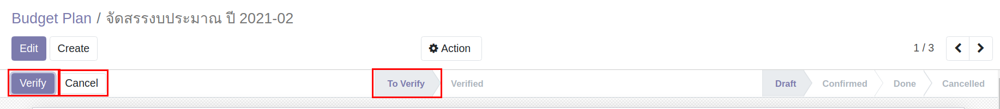
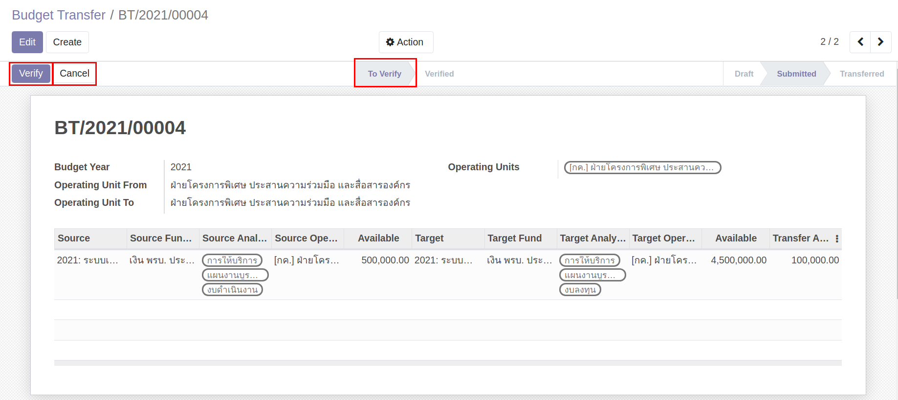
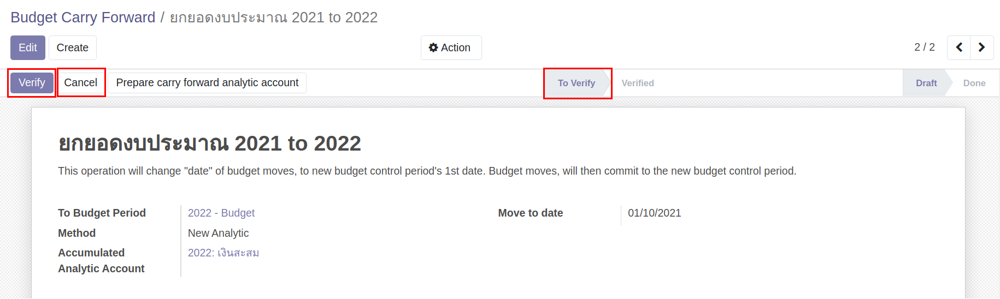

# ระบบบริหารงบประมาณ (Budgeting Management System)

**เอกสารนี้สำหรับ ::** ผู้มีสิทธิ Verify เอกสารต่างๆ

## การ Verify Budget Plan

หลังจากได้รับแจ้งให้ Verify เอกสาร Budget Plan จากทางฝ่ายแผน ทำการ Verify ตามขั้นตอนดังนี้

**Menu ::** Budgeting > Budgeting > Budget Plan

1. เลือก Budget Plan ที่ได้รับแจ้งให้ทำการ Verify สถานะเอกสารอยู่ที่ To Verify
2. ตรวจสอบเอกสาร Budget Plan
    - หากถูกต้องครบถ้วน กดปุ่ม "Verify"
    - หากไม่ถูกต้อง กดปุ่ม "Cancel"

3. หลักจาก Verify หรือ Cancel เสร็จแล้ว แจ้งกลับฝ่ายแผนให้ดำเนินงานต่อในขั้นตอนถัดไป

## การ Verify Budget Trnasfer

หลังจากได้รับแจ้งให้ Verify เอกสาร Budget Transfer จากพนักงานทั่วไป (Budget User) ทำการ Verify ตามขั้นตอนดังนี้

**Menu ::** Budgeting > Budgeting > Budget Transfer

1. เลือกเอกสาร Budget Transfer ที่ได้รับแจ้งให้ทำการ Verify สถานะเอกสารอยู่ที่ To Verify
2. ตรวจสอบเอกสาร 
    - หากถูกต้องครบถ้วน กดปุ่ม "Verify" ระบบจะส่งเอกสารขออนุมัติตามลำดับ
    - หากไม่ถูกต้อง กดปุ่ม "Cancel" ระบบจะยกเลิกเอกสารคืนพนักงานทั่วไป

## การ Verify Budget Carry Forward

หลังจากได้รับแจ้งให้ Verify เอกสาร Budget Carry Forward จากทางฝ่ายแผน ทำการ Verify ตามขั้นตอนดังนี้

**Menu ::** Budgeting > Budgeting > Budget Carry Forward

1. เลือก Budget Carry Forward ที่ได้รับแจ้งให้ทำการ Verify สถานะเอกสารอยู่ที่ To Verify
2. ตรวจสอบเอกสาร 
    - หากถูกต้องครบถ้วน กดปุ่ม "Verify"
    - หากไม่ถูกต้อง กดปุ่ม "Cancel"

3. หลักจาก Verify หรือ Cancel เสร็จแล้ว แจ้งกลับฝ่ายแผนให้ดำเนินงานต่อในขั้นตอนถัดไป