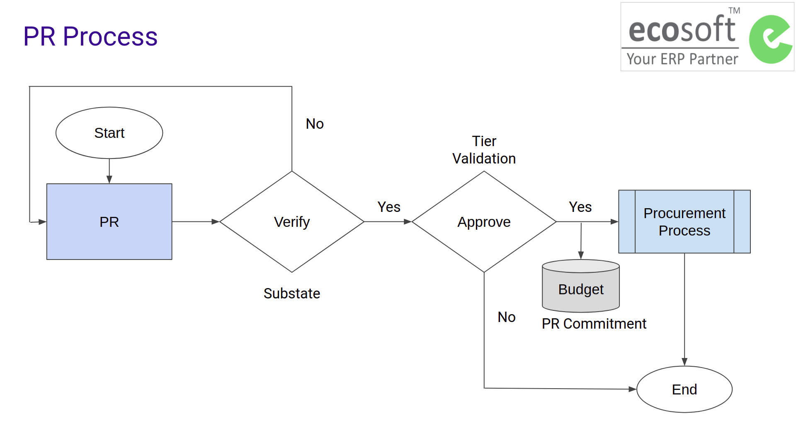

# กระบวนการขอซื้อขอจ้าง (Purchase Request)

การขอซื้อขอจ้าง หมายถึงกระบวนการที่พนักงาน/นักวิจัย มีความประสงค์จะขอซื้อพัสดุหรือบริการ
โดยจะทำการยื่นคำขอผ่านเอกสาร Purchase Request ซึ่งจะผ่านกระบวนการตรวจสอบเอกสาร
และการอนุมัติวงเงินการจัดซื้อตามลำดับของผู้มีอำนาจ หากการขอซื้อได้รับการอนุมัติ
ระบบจะทำการจองงบประมาณ และเข้าสู่กระบวนการจัดซื้อจัดจ้างต่อไป

**กระบวนการทั่วไปเป็นดังนี้**

1. ผู้ขอซื้อ (Employee) สร้างเอกสาร Purchase Request และส่งคำขอไปยังฝ่ายพัสดุ (To Verify)
2. หัวหน้าเจ้าหน้าที่พัสดุ ทำการตรวจสอบเอกสาร (Verify) และส่งต่อการอนุมัติวงเงิน (Request Validation)
3. เอกสารจะถูกอนุมัติเป็นลำดับชั้นตามวงเงินที่ขอ (Tier Validation)
4. หัวหน้าเจ้าหน้าที่พัสดุ (Procurement Head) ทำการแจกจ่ายงานให้กับเจ้าหน้าที่ผู้รับผิดชอบ (Purchase Responsible)
5. หลังจากเอกสารที่ได้รับการอนุมัติ (Approved) จะได้เข้ากระบวนการจัดซื้อจัดจ้างต่อไป

## User Roles

1. Employee: ผู้ขอซื้อขอจ้าง เช่น พนักงาน นักวิจัย
2. Procurement Officer: เจ้าหน้าที่พัสดุ ทำหน้าที่จัดซื้อจัดจ้าง หลังจากได้รับการอนุมัติวงเงิน
2. Procurement Head: หัวหน้าเจ้าหน้าที่พัสดุ ทำหน้าที่เหมือนกับเจ้าหน้าที่พัสดุ แต่จะมีอำนาจในการตรวจสอบเอกสาร (Verify PR) ก่อนที่จะส่งอนุมัติวงเงิน (Request Validation)
3. Budget Approver(s): ผู้อนุมัติตามวงเงินเป็น Employee ที่มีตำแหน่งในหน้าที่ตามวงเงินอนุมัติ

!!! Note
      - Employee จะเห็นเฉพาะเอกสารใน Operating Unit ตัวเอง
      - Procurement Officer/Head จะเห็นเอกสารทั้งหมดในทุก Operating Unit

## Use Cases

 1. ขอซื้อขอจ้าง Purchase Request

!!! Note
      - การสร้างเอกสารใบขอซื้อจ้าง (Purchase Request:PR) และกระบวนการทำงานในระบบไม่มีความแตกต่าง ไม่ว่าจะจัดซื้อจัดจ้างวัสดุคงคลังหรือไม่ใช่วัสดุคงคลัง ไม่ว่าจะเป็นการซื้อ/จ้าง/เช่า และหรือวิธีการจัดซื้อจัดจ้างแบบใด
