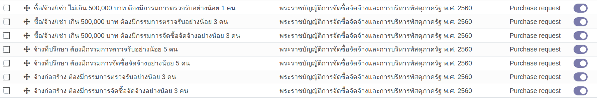

# กระบวนการขอซื้อขอจ้าง (Purchase Request)

**เอกสารนี้สำหรับ ::** ผู้ดูแลระบบ (System Administrator)

1. การตั้งค่าสิทธิ์สำหรับผู้ใช้งาน (User Role)
2. การตั้งค่าการตรวจเอกสารตาม พ.ร.บ. (Purchase Request Exception)
3. การตั้งค่าการอนุมัติตามวงเงิน (Tier Validation)

## 1. การตั้งค่าสิทธิ์สำหรับผู้ใช้งาน

**Menu ::** Settings > Users & Companies > Users

- สำหรับผู้ขอซื้อขอจ้าง ต้องมี Role เป็น Employee
- สำหรับเจ้าหน้าที่พัสดุ ต้องมี Role เป็น Procurement Officer
- สำหรับหัวหน้าเจ้าหน้าที่พัสดุ ต้องมี Role เป็น Procurement Head

## 2. การตั้งค่าการตรวจเอกสาร ตามรูปแบบการขอซื้อ เพื่อการแต่งตั้งคณะกรรมการ (Committee)

**Menu ::** Purchase > Configuration > Purchase Request Exception Rules

!!! Note
    - อ้างอิงจาก พ.ร.บ. จัดซื้อจัดจ้าง 2560
    - ระบบได้มีการตั้งค่าให้เป็นปัจจุบันแล้ว หน้าต่างนี้ใช้สำหรับตรวจสอบความถูกต้อง

## 3. การตั้งค่าการอนุมัติคำขอตามวงเงิน

**Menu ::** Settings > Technical > Tier Validations > Tier Definition

