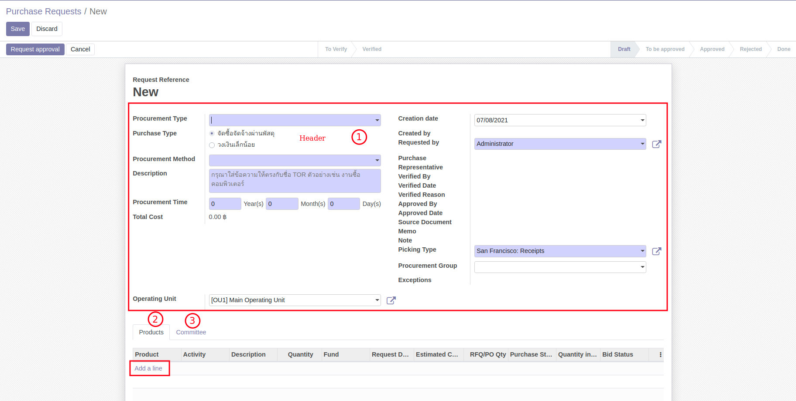
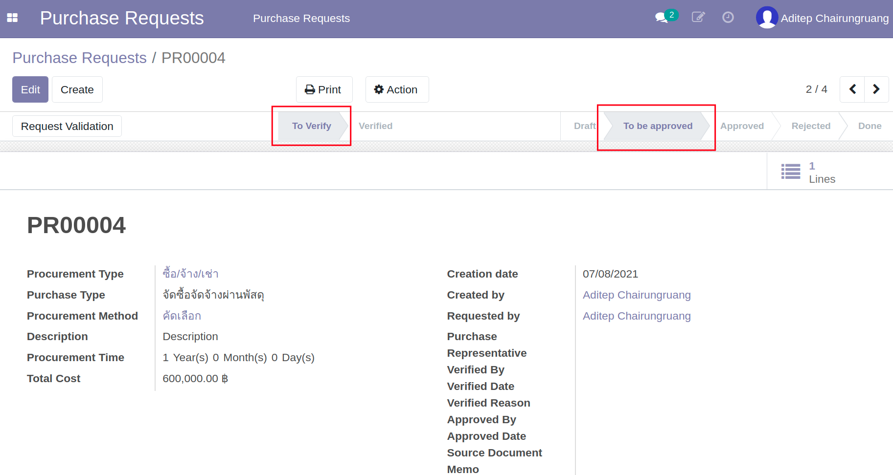

# กระบวนการขอซื้อขอจ้าง (Purchase Request)

**เอกสารนี้สำหรับ ::** ผู้ขอจัดซื้อจัดจ้าง (Employee)

## การสร้างใบขอซื้อจ้าง (Purchase Request:PR)

**Menu ::** Purchase Requests > Purchase Requests > Purchase Requests
      

    
1. กดปุ่ม Create เพื่อสร้าง Purchase Request ที่ Header เลือก/กรอกข้อมูลดังนี้
    1. Procurement Type: ประเภทของการซื้อ
        * ซื้อ/จ้าง/เช่า
        * จ้างที่ปรึกษา
        * จ้างก่อสร้าง
    2. Purchase Type: ระเบียบการ
        * จัดซื้อจัดจ้างผ่านพัสดุ
        * วงเงินเล็กน้อย
    3. Procurement Method: วิธีการจัดซื้อจัดจ้าง
        * เฉพาะเจาะจง
        * คัดเลือก
        * ประกาศเชิญชวนทั่วไป e-bidding
        * ประกาศเชิญชวนทั่วไป e-market
    4. Description: รายละเอียดของการจัดซื้อ
    5. Procurement Time: ระยะเวลาการดำเนินการ
    6. Total Cost: วงเงินรวม
    7. Creation Date: วันที่สร้างเอกสาร
    8. Created By: ผู้สร้างเอกสาร
    9. Requested By: ผู้ขอ (อาจไม่ใช่ผู้สร้างเอกสาร กรณีทำแทน)
    10. Purchase Representative: เจ้าพนักงานจัดซื้อจัดจ้างที่ได้รับมอบหมาย
    11. Verified By: ผู้ตรวจสอบเอกสาร (หัวหน้าเจ้าพนักงานจัดซื้อจัดจ้าง)
    12. Verified Date: วันที่ตรวจสอบเอกสาร
    13. Verified Reason: ความเห็นของผู้ตรวจสอบเอกสาร
    14. Approved By: ผู้อนุมัติวงเงิน (คนสุดท้ายในลำดับการอนุมัติ)
    15. Approved Date: วันที่อนุมัติวงเงิน
    16. Source Document: เลขที่โครงการ (ระบบ e-GP)
    17. Memo: เลขที่บันทึกข้อความ
    18. Note: ข้อเสนออื่นๆ
    19. Picking Type
    20. Procurement Group
    21. Exceptions: แสดง Exception ทั้งหมดบน PR เช่น คณะกรรมการไม่ถูกต้อง 
    22. Operating Unit: ฝ่ายใน สสน.

2. แท็บ Product เพิ่มรายการที่ต้องการขอซื้อขอจ้าง โดยมีข้อมูลดังนี้
    1. Activity: เนื้องานที่ต้องการขอซื้อจ้าง
    2. Product: สินค้าที่ขอซื้อจ้าง (ระบบ default ตาม Procurement Type แก้ไขได้ถ้าเป็นสินค้าอื่นที่เข้าคลัง)
    3. Description: รายละเอียดเพิ่มเติมการขอซื้อจ้าง
    4. Quantity: จำนวนที่ต้องการ
    5. Analytic Account: ชื่อโครงการหรือชื่อหน่วยงานที่ต้องการใช้งบประมาณ
    6. Fund: ชื่อแหล่งทุนของโครงการหรือหน่วยงานที่ใช้งบประมาณ
    7. Analytic Tags: ข้อมูลกลุ่มงบประมาณ แผนงาน ประเภทงบประมาณ
    8. Requested Date: วันที่ต้องการ
    9. Estimated Cost: งบประมาณ

    

     

3. แท็บ Committee รายชื่อคณะกรรมการ เงื่อนไขเป็นไปตามจำนวนเงินรวม และข้อมูลการจัดซื้อจัดจ้างต่างๆ Procurement Type, Purchase type และ Procurement method ให้เพิ่มรายชื่อคณะกรรมการการจัดซื้อจัดจ้างและคณะกรรมการการตรวจรับ (Committee) ตาม พ.ร.บ. โดยมีข้อกำหนดดังต่อไปนี้

    

    !!! Note
        - หากจำนวนคณะกรรมการไม่สอดคล้องกับเกณฑ์ พ.ร.บ. ระบบจะออกคำเตือนเมื่อกดปุ่ม Request Approval ดังตัวอย่างเช่น

        

    !!! Info
        สรุปหลักการจำนวนรายชื่อคณะกรรมการการจัดซื้อจัดจ้างและคณะกรรมการการตรวจรับตาม พ.ร.บ. 2560

        * ระเบียบ วงเงินเล็กน้อย ไม่เกิน 100,000 บาท ต้องมีกรรมการตรวจรับอย่างน้อย 1 คน
        * ซื้อ/จ้าง/เช่า ไม่เกิน 500,000 บาท ต้องมีกรรมการตรวจรับอย่างน้อย 1 คน
        * ซื้อ/จ้าง/เช่า เกิน 500,000 บาท ต้องมีกรรมการจัดซื้อจัดจ้างอย่างน้อย 3 คน และกรรมการตรวจรับอย่างน้อย 3 คน
        * จ้างที่ปรึกษา ต้องมีกรรมการจัดซื้อจัดจ้างอย่างน้อย 5 คน และกรรมการตรวจรับอย่างน้อย 5 คน
        * จ้างก่อสร้าง ต้องมีกรรมการจัดซื้อจัดจ้างอย่างน้อย 3 คน และกรรมการตรวจรับอย่างน้อย 3 คน

4. หากมีข้อมูลแนบเพื่อการพิจารณาสามารถเพิ่มได้ที่ รูปคลิป ด้านล่างของเอกสาร

    
    
     

5. กดปุ่ม Print - Purchase Request เพื่อตรวจสอบความถูกต้อง

    

     

6. กดปุ่ม Request Approval เพื่อส่งเอกสาร Purchase Request นี้ไปยังฝ่ายพัสดุเพื่อตรวจทานและส่งอนุมัติการจัดซื้อจัดจ้างและการเบิกใช้งบประมาณต่อไป
      - Substate = To Verify
      - State = To be approved

    

End.
