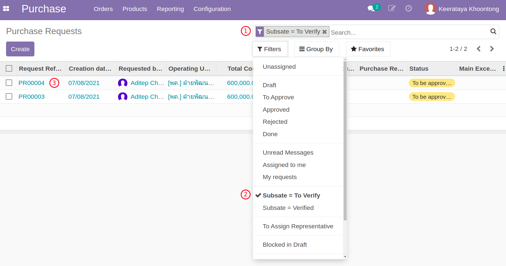

# กระบวนการขอซื้อขอจ้าง (Purchase Request)

**เอกสารนี้สำหรับ ::** หัวหน้าเจ้าหน้าที่พัสดุ (Procurement Head)

## ตรวจสอบเอกสาร

**Menu ::** Purchase > Orders > Purchase Requests

1. ค้นหารายการ Purchase Request เพื่อทำการตรวจสอบ
      1. ลบตัวกรองเดิม (My requests)
      2. กรองหา Custom Filter ด้วย Substate = To Verify
      3. ระบบจะแสดงรายการที่รอการตรวจสอบ

    

2. อนุมัติการตรวจสอบเอกสาร (Verify)
      1. เลือก Purchase Request ที่ต้องการอนุมัติ
      2. ถ้าเรียบร้อย กดปุ่ม Verify ระบบมีให้กรอกความเห็นของผู้ตรวจสอบ สถานะ Substate เปลี่ยนเป็น Verified (อนุมัติแล้ว)

    

    !!! Note
        - ถ้าไม่เรียบร้อย กดปุ่ม Reject เพื่อปฏิเสธคำขอ

3. หลังจาก Verify ระบบ จะ Request Validation ให้อัตโนมัติ เพื่อขออนุมัติงบประมาณ

    ขั้นตอนนี้จะส่งเอกสารไปยังผู้ที่เกี่ยวข้องกับการอนุมัติวงเงินตามอำนาจหน้าที่ ซึ่งบุคคลที่เกี่ยวข้องตามตารางอนุมัติจะทำหน้าการอนุมัติ (หรือปฏิเสธ) หากเอกสารได้รับการอนุมัติจากคนสุดท้ายแล้ว สถานะของเอกสารจะเปลี่ยน State = Approved

    

    !!! Info
        สรุปหลักการหาผู้อนุมัติเอกสารตามวงเงิน

        * วงเงิน > 0 :: หัวหน้างาน และ ผอ.ฝ่าย
        * วงเงิน > 500,000 และ <= 1,000,000 :: รอง ผอ
        * วงเงิน > 500,000 :: ผอ.สสน.

4. เมื่อผู้อนุมัติสุดท้าย Approved ระบบจะส่ง Email แจ้งการแต่งตั้งคณะกรรมการซื้อหรือจ้าง และคณะกรรมการตรวจรับ ไปยังคณะกรรมการทุกคน

End.

---------------------------------------------

## มอบหมายงานให้เจ้าหน้าที่พัสดุ

**Menu ::** Purchase > Orders > Purchase Requests

1. ค้นหารายการ Purchase Request ที่ยังไม่มีเจ้าหน้าที่รับผิดชอบ
      1. ลบตัวกรองเดิม (My requests)
      2. เลือกตัวกรอง Approved และ Unassigned
      3. ระบบจะแสดงรายการที่ยังไม่มีผู้รับผิดชอบ

    

2. เลือกรายการที่ต้องการเพื่อทำการมอบหมายงาน
      1. กดปุ่ม Edit
      2. เลือก Purchase Responsible และกด Save

    

End.