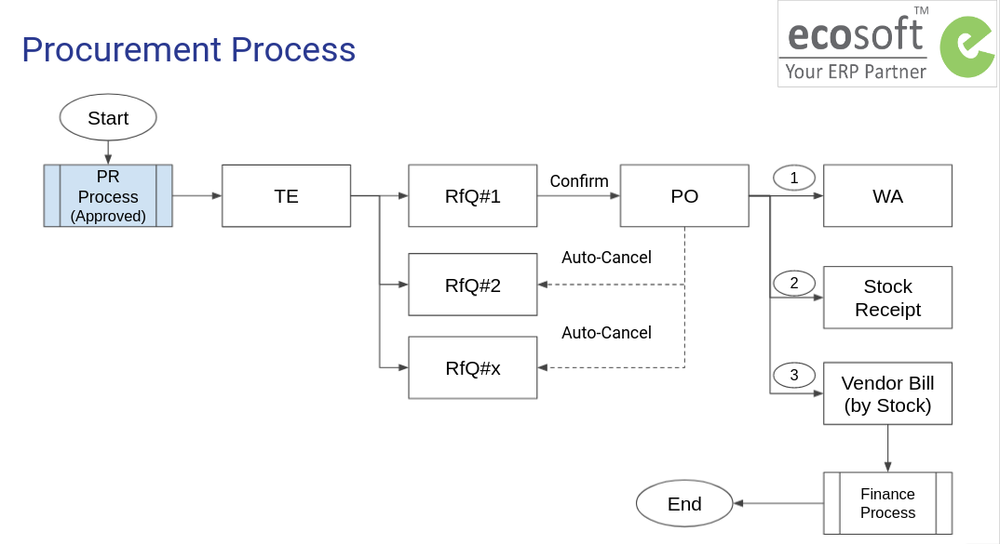

# กระบวนการจัดซื้อจัดจ้าง

กระบวนการนี้เป็นกระบวนการต่อเนื่องจากเอกสาร Purchase Request ที่ได้รับการอนุมัติแล้ว
โดยผู้ที่รับผิดชอบในกระบวนการทำงานขั้นตอนต่อไป คือ เจ้าหน้าที่พัสดุที่ได้รับมอบหมาย (Purchase Representative)

วัตถุประสงค์ของกระบวนการนี้ คือ การให้ได้มาซึ่งการจัดซื้อจัดจ้างรวมถึงวัสดุและ/หรือบริการ ประกอบด้วยขั้นตอนหลัก ดังนี้

1. เอกสารต้นทางการจัดซื้อจัดจ้าง Purchase Agreement (TE) เพื่อรวบรวมข้อมูลใบเสนอราคาจากผู้ขาย/ผู้ให้บริการที่เกี่ยวข้องทั้งหมดไว้ในระบบ (RFQ)
2. การเลือกผู้ขาย/ผู้ให้บริการที่ได้รับการคัดเลือกจากการจัดซื้อจัดจ้าง และออกใบสั่งซื้อจ้าง (RFQ -> PO)
3. การตรวจรับสินค้า/บริการโดยคณะกรรมการ (PO -> WA)
4. การสร้างใบแจ้งหนี้ในระบบ (PO -> Vendor Bill) เพื่อส่งต่อให้การเงินบัญชี

**กระบวนการทั่วไปเป็นดังนี้**

1. เจ้าหน้าที่พัสดุ (Procurement Officer) สร้างเอกสารต้นทางสำหรับการจัดซื้อจัดจ้าง เพื่อรวบรวมใบเสนอราคาจากผู้ขาย/ผู้ให้บริการ (Purchase Agreement:TE)
2. เจ้าหน้าที่พัสดุ บันทึกใบเสนอราคาจากผู้ขาย/ผู้ให้บริการ เข้าระบบโดยการสร้างใบสั่งซื้อสั่งจ้างร่าง/ใบขอราคา RFQs จากหน้าเอกสาร Purchase Agreement:TE
3. เจ้าหน้าที่พัสดุ เลือก RFQ ที่ได้รับการคัดเลือก และยืนยันในระบบ เพื่อเปลี่ยนสถานะเอกสารเป็น ใบสั่งซื้อสั่งจ้าง (Purchase Order:PO) และระบบจะยกเลิก RFQ ใบอื่นๆ ที่ไม่ได้รับการคัดเลือกให้อัตโนมัติ
4. เจ้าหน้าที่พัสดุ สร้างเอกสารตรวจรับซึ่งจะมีคณะกรรมการการตรวจรับที่แต่งตั้งไว้ตั้งแต่ขั้นตอนการขอซื้อขอจ้าง (Purchase Request:PR)
5. กรณีซื้อวัสดุสำนักงาน เจ้าหน้าที่พัสดุรับสินค้าเข้าคลัง
6. เจ้าหน้าที่พัสดุ สร้างใบแจ้งหนี้และบันทึกเลขที่ใบแจ้งหนี้จากผู้ขาย/ผู้ให้บริการ เพื่อส่งต่อให้การเงินบัญชีต่อไป (Finance Process)

## User Roles

1. Procurement Officer: เจ้าหน้าที่พัสดุ ทำหน้าที่ทุกขั้นตอนเพื่อให้ได้มาซึ่งการตรวจรับพัสดุ

!!! Note
      - Procurement Officer จะเห็นเอกสารทั้งหมดในทุก Operating Unit
      - Employee ผู้ขอซื้อขอจ้างไม่มีส่วนเกี่ยวข้องกับกระบวนการนี้

## Use Cases

1. ไม่ใช่วัสดุเข้าคลัง งวดเดียว
2. ไม่ใช่วัสดุเข้าคลัง หลายงวด
3. วางเงินประกันซอง e-Bidding (TE Guarantee)
4. หักเงินประกันผลงาน (Retention)
5. วางเงินประกันสัญญา (RFQ Guarantee)
6. วัสดุเข้าคลัง งวดเดียว
7. วัสดุเข้าคลัง หลายงวด
