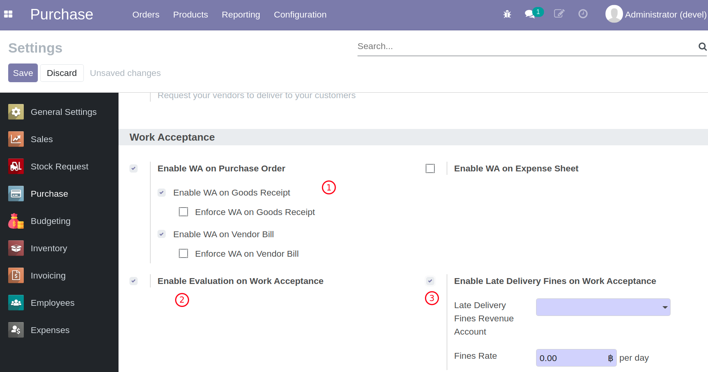

# กระบวนการจัดซื้อจัดจ้าง

**เอกสารนี้สำหรับ ::** ผู้ดูแลระบบ (System Administrator)

1. การตั้งค่าสิทธิ์สำหรับผู้ใช้งาน (User Role)
2. การตั้งค่าการใช้งานโมดูลการตรวจรับ (Work Acceptance)
<!-- 3. การตั้งค่าสำหรับการประกันผลงาน (Retention)
4. การตั้งค่าสำหรับการประกันสัญญาและประกันซอง e-Bidding (Guarantee) -->

## 1. การตั้งค่าสิทธิ์สำหรับผู้ใช้งาน

**Menu ::** Settings > Users & Companies > Users

- สำหรับผู้ทำหน้าที่เจ้าหน้าที่พัสดุ ต้องมี Role เป็น Procurement Officer

## 2. การตั้งค่าการใช้งานโมดูลการตรวจรับ (Work Acceptance)

**Menu ::** Purchase > Configurations > Settings

โมดูลการตรวจรับพัสดุ แบ่งเป็น 3 เรื่องคือ

1. Enable WA on Purchase Order :: การสร้าง Work Acceptance จากหน้าต่าง Purchase Order
    * Work Acceptance ถือเป็นจุดเริ่มต้น เมื่อเรียกใช้แล้วสามารถเพิ่ม Option ที่ 2 และ 3 ได้
    * WA เป็นเอกสารที่สร้างขึ้นจาก Purchase Order
    * เลือก Enable WA on Goods Receipt หาต้องการใช้ WA ในการควบคุมการรับสินค้าเข้าคลัง (Stock IN)
    * เลือก Enable WA on Vendor Bill หากต้องการใช้ WA ในการควบคุมการออกเอกสารการรับแจ้งหนี้ (Vendor Bill)
2. Enable Evaluation on Work Acceptance :: เพิ่มการประเมินผลงานในการตรวจรับ
3. Enable Late Delivery Fines on Work Acceptance :: เพิ่มค่าปรับกรณีส่งของล่าช้า
    * กำหนดอัตราค่าปรับเบื้องต้นเป็นจำนวนเงินต่อวัน
    * กำหนดบัญชีรายได้ค่าปรับ

<!-- ## 3. การตั้งค่าสำหรับโมดูลเงินการประกันผลงาน (Retention)

**Menu ::** Invoicing > Configurations > Settings

1. Enable Invoice's Retention on Payment :: เพิ่มทางเลือกในการกำหนดการหักเงินประกันผลงานจากหน้าต่าง Purchase Order ในกรณีมี Invoice Plan
2. Retention Account :: กำหนด Account Code ที่ใช้ในการหักเงินประกัน

## 4. การตั้งค่าสำหรับการประกันสัญญาและประกันซอง e-Bidding (Guarantee)

**Menu ::** Purchase > Configurations > Guarantee > Guarantee Method

**Menu ::** Purchase > Configurations > Guarantee > Guarantee Method

 -->
