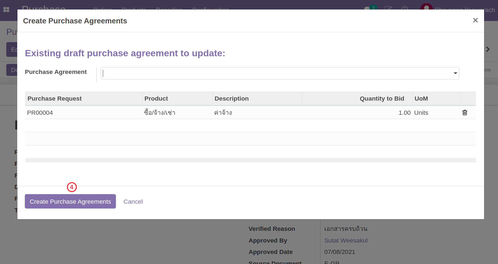
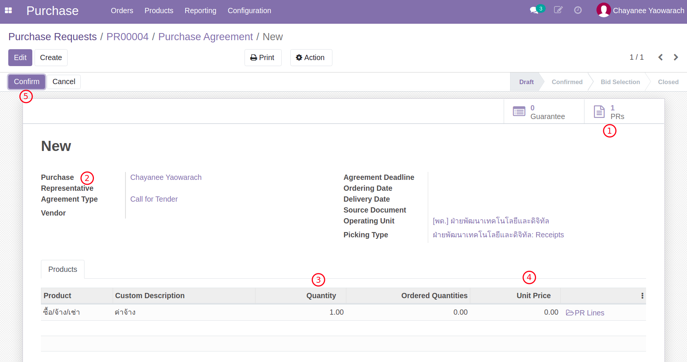
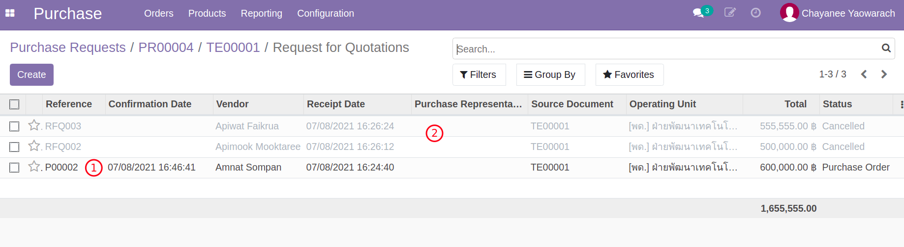
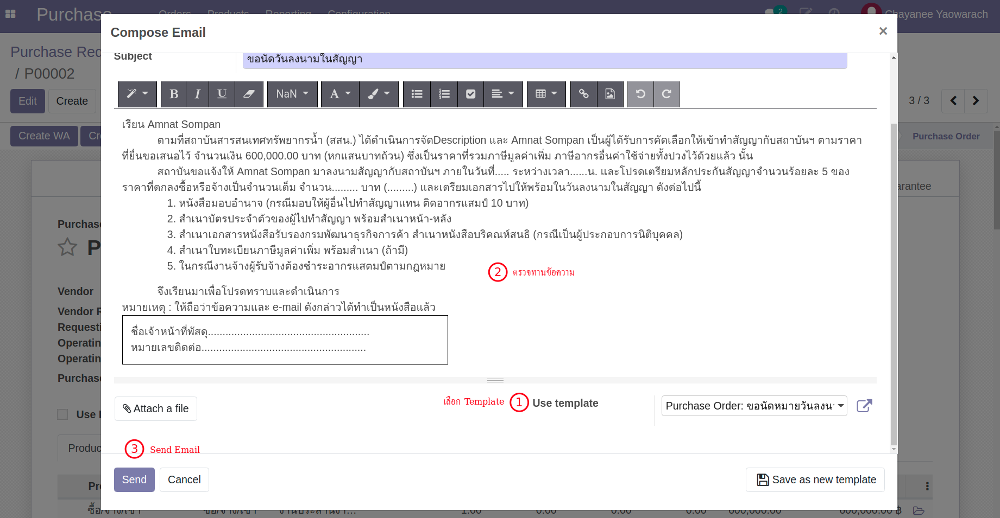
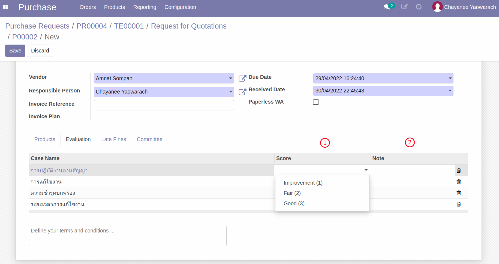

# กระบวนการจัดซื้อจัดจ้าง

**เอกสารนี้สำหรับ ::** เจ้าหน้าที่พัสดุ (Procurement Officer)

## สร้างเอกสารการเสนอราคา Purchase Agreement/TE จาก PR

**Menu ::** Purchase > Orders > Purchase Requests

1. ค้นหารายการ Purchase Request เพื่อสร้าง Purchase Agreement
    1. เอกสารอนุมัติแล้ว (Approved)
    2. เอกสารได้รับการมอบหมาย (Purchase Responsible)
    3. คลิกที่ action, Create Purchase Agreemnt
    4. ตรวจสอบ Product และ Quantity และกดปุ่ม Create Purchase Agreement

    

    

    ระบบจะพาไปยังเอกสาร Purchase Agreement (TE) ที่ถูกสร้างขึ้นใหม่ ให้คลิกเพื่อเปิดเอกสาร

     

2. ตรวจสอบความถูกต้อง และยืนยันเอกสาร TE
    1. ที่ TE นี้จะเห็น Link กลับไปที่ PR ได้ (ที่ PR จะมี Link กลับมาที่ TE เช่นกัน)
    2. Purchase Responsible: จะเป็นชื่อของเจ้าหน้าที่พัสดุ (เปลี่ยนแปลงได้หากต้องการโยกงาน)
    3. Quantity: จำนวนขอซื้อ
    4. Unit Price: ราคาต่อ 1 หน่วย
    5. กดปุ่ม Confirm เพื่อยืนยันเอกสาร

    

    !!! Note
        - เอกสาร TE เป็นเสมือนเอกสารตั้งต้นเพื่อเป็นตัวช่วยในการสร้างและติดตาม RFQ ทั้งหมดที่เกี่ยวข้องกับการจัดซื้อจัดจ้างนี้

End.

-----------------------------------------------------------------

## สร้างใบเสนอราคา RFQ (จาก Purchase Agreement/TE)

**Menu ::** Purchase > Orders > Purchase Agreements

1. ค้นหาเลขที่ TE ที่ต้องการบันทึกใบเสนอราคาจากผู้ขาย/ผู้ให้บริการ และเปิดเอกสาร TE
2. สร้าง RFQ ตามเอกสารใบเสนอราคาที่ได้รับจากผู้ขาย/ผู้ให้บริการ
    1. กดปุ่ม New Quotation เพื่อสร้าง RFQ สำหรับแต่ละ Vendor
    
    2. ที่หน้าต่าง New RFQ ทำการเลือก Vendor
    3. ปรับยอดเงินตามที่ได้รับข้อเสนอจาก Vendor ที่เลือก
    4. ย้อนกลับไปที่ TE เพื่อสร้าง RFQ เพิ่มเติมจนครบ (ยังไม่ต้อง Confirm เอกสาร)
    

    !!! Note 
        - ในระหว่างนี้ ทางพัสดุอาจมีการปรับแก้ข้อตกลงจาก Vendor บน RFQ เหล่านี้

3. ส่งเอกสาร RFQ เข้ากระบวนการอนุมัติจัดซื้อจัดจ้าง
    1. สำหรับ RFQ ที่เลือก ให้กดปุ่ม Request Validation
    
    2. เอกสารนี้จะเข้ากระบวนการอนุมัติ ซึ่งตารางการอนุมัติจะแสดงอยู่ที่ด้านล่างของเอกสาร
    
    
    !!! Info
            - การอนุมัติในระบบไม่ขึ้นกับจำนวนเงิน โดยผู้อนุมัติ คือ หัวหน้าพัสดุ และ ผอ.ฝ่าย อน.

    !!! Note
        - เอกสาร RFQxxx ที่ส่งเข้ารับการอนุมัติ ในภายหลังเมื่อได้รับการอนุมัติแล้ว
            - เอกสารจะเปลี่ยนสถานะเป็น Purchase Order และเลขที่เอกสารจะเปลี่ยนเป็น POxxx
            - และในเวลาเดียวกัน RFQ อื่นจะถูกยกเลิก และบันทึกเหตุผลการยกเลิก "ไม่ได้รับการคัดเลือก"

        

4. กดปุ่ม Print - Purchase Order เพื่อตรวจสอบความถูกต้อง

5. ส่ง Email ขอนัดหมายวันลงนามในสัญญากับ Vendor

End.

-----------------------------------------------------------------

## สร้างเอกสารตรวจรับวัสดุ WA จาก PO

!!! Note
      ขั้นตอนนี้เกิดขึ้นในวันที่มีการตรวจรับจริง

**Menu ::** Purchase > Orders > Purchase Orders

1. เลือก Purchase Order ที่ผ่านการอนุมัติแล้วที่ต้องการสร้างเอกสารตรวจรับ WA
2. กดปุ่ม Create WA ระบบจะพาไปยังหน้าต่าง Work Acceptance พร้อมข้อมูลตั้งต้นจาก PO
      1. กดปุ่ม Save เพื่อสร้างเอกสาร WA
      2. แก้ไขข้อมูลการตรวจรับ ตามจำนวนที่รับจริง (Quantity)
      3. Due Date คือวันที่กำหนดส่งจาก Vendor
      4. Received Date คือวันที่ได้ตรวจรับจริง (มีผลกับค่าปรับ)
      

3. ประเมินผลการตรวจรับ (Evaluation)
      1. ให้คะแนนตามคุณภาพวัสดุส่งมอบในแต่ละหัวข้อ
      2. เพิ่มเติมหมายเหตุตามต้องการ
      

    !!! Note
        แต่ละหัวข้อการให้คะแนนสามารถปรับเปลี่ยนและตั้งค่าได้ว่าจำเป็นต้องใส่หรือไม่

4. ประเมินค่าปรับ (Late Fines)
      1. Late Days หรือจำนวนวันที่ล่าช้า คำนวนจากวันส่งจริง และวันที่กำหนดส่ง (Received Date - Due Date)
      

    !!! Note
        สำหรับ WA ที่มีค่าปรับจะมีปุ่มเพื่อให้สามารถสร้างใบแจ้งหน้าค่าปรับได้ (เฉพาะผู้ใช้งานที่มีสิทธิ์ในโมดูล Accounting) หรือจะเลือกสร้างจากหน้าต่าง Customer Invoice ก็ได้เช่นกัน
        

5. ตรวจสอบ คณะกรรมการตรวจรับ (Committee)
      1. รายชื่อคณะกรรมการตรวจรับระบบดึงมาจากเอกสาร Purchase Request ตั้งต้น
      

6. พิมพ์ฟอร์ม Work Acceptance
      

7. หากทุกอย่างเรียบร้อยให้กดปุ่ม Accept (หรือ Reject หากไม่รับ)

8. ส่งอีเมล์ผลการตรวจรับพัสดุสำหรับแจ้ง Vendor

End.