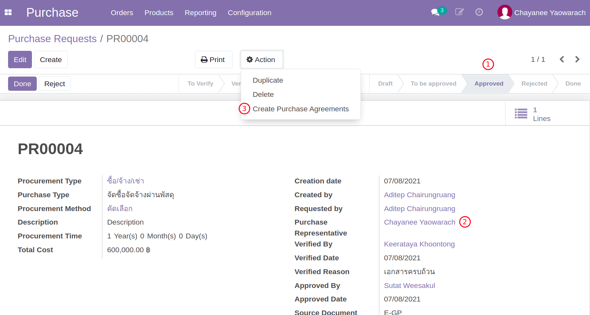
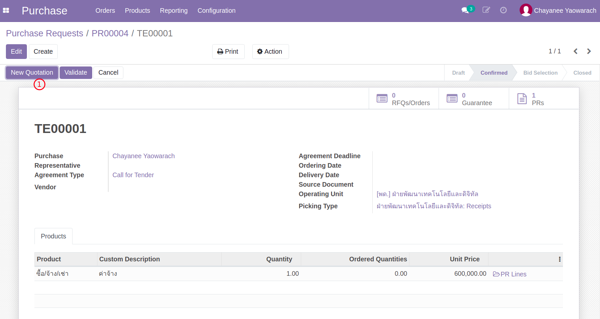
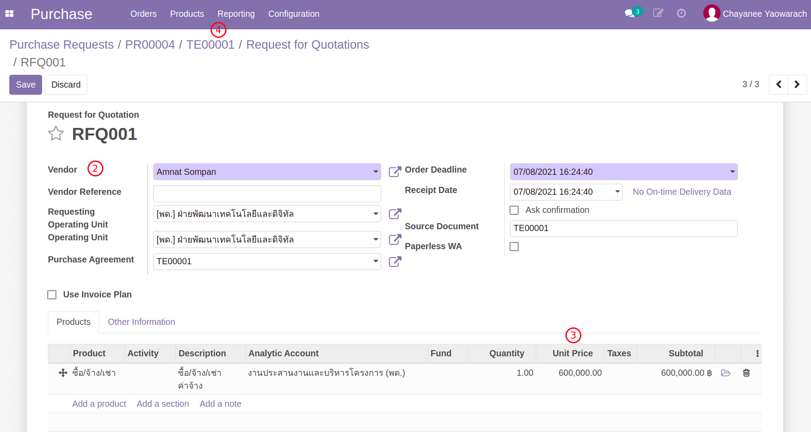
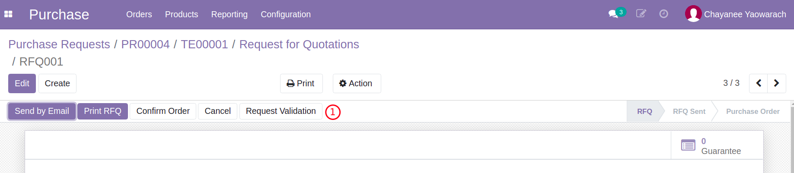
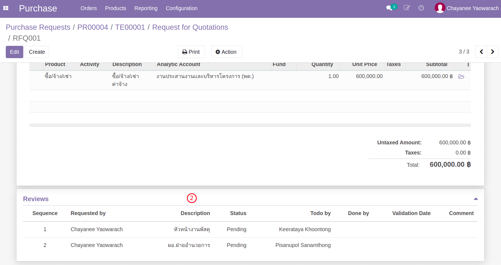

# กระบวนการจัดซื้อจัดจ้าง

**เอกสารนี้สำหรับ ::** เจ้าหน้าที่พัสดุ (Procurement Officer)

## สร้างเอกสารการเสนอราคา Purchase Agreement/TE จาก PR

**Menu ::** Purchase > Orders > Purchase Requests

1. ค้นหารายการ Purchase Request เพื่อสร้าง Purchase Agreement
    1. เอกสารอนุมัติแล้ว (Approved)
    2. เอกสารได้รับการมอบหมาย (Purchase Responsible)
    3. คลิกที่ action, Create Purchase Agreemnt
    4. ตรวจสอบ Product และ Quantity และกดปุ่ม Create Purchase Agreement

    

    

    ระบบจะพาไปยังเอกสาร Purchase Agreement (TE) ที่ถูกสร้างขึ้นใหม่ ให้คลิกเพื่อเปิดเอกสาร

     

2. ตรวจสอบความถูกต้อง และยืนยันเอกสาร TE
    1. ที่ TE นี้จะเห็น Link กลับไปที่ PR ได้ (ที่ PR จะมี Link กลับมาที่ TE เช่นกัน)
    2. Purchase Responsible: จะเป็นชื่อของเจ้าหน้าที่พัสดุ (เปลี่ยนแปลงได้หากต้องการโยกงาน)
    3. Quantity: จำนวนขอซื้อ
    4. Unit Price: ราคาต่อ 1 หน่วย
    5. กดปุ่ม Confirm เพื่อยืนยันเอกสาร

    

    !!! Note
        - เอกสาร TE เป็นเสมือนเอกสารตั้งต้นเพื่อเป็นตัวช่วยในการสร้างและติดตาม RFQ ทั้งหมดที่เกี่ยวข้องกับการจัดซื้อจัดจ้างนี้

End.

-----------------------------------------------------------------

## สร้างใบเสนอราคา RFQ (จาก Purchase Agreement/TE)

**Menu ::** Purchase > Orders > Purchase Agreements

1. ค้นหาเลขที่ TE ที่ต้องการบันทึกใบเสนอราคาจากผู้ขาย/ผู้ให้บริการ และเปิดเอกสาร TE
2. สร้าง RFQ ตามเอกสารใบเสนอราคาที่ได้รับจากผู้ขาย/ผู้ให้บริการ
    1. กดปุ่ม New Quotation เพื่อสร้าง RFQ สำหรับแต่ละ Vendor
    
    2. ที่หน้าต่าง New RFQ ทำการเลือก Vendor
    3. ปรับยอดเงินตามที่ได้รับข้อเสนอจาก Vendor ที่เลือก
    4. ย้อนกลับไปที่ TE เพื่อสร้าง RFQ เพิ่มเติมจนครบ (ยังไม่ต้อง Confirm เอกสาร)
    

    !!! Note 
        - ในระหว่างนี้ ทางพัสดุอาจมีการปรับแก้ข้อตกลงจาก Vendor บน RFQ เหล่านี้

3. เข้าไป RFQ ที่เลือก ส่ง Email ไปถึง Vendor (ถ้ามี) เช่น ขอนัดหมายวันลงนามในสัญญา 

4. ส่งเอกสาร RFQ เข้ากระบวนการอนุมัติจัดซื้อจัดจ้าง
    1. สำหรับ RFQ ที่เลือก ให้กดปุ่ม Request Validation
    
    2. เอกสารนี้จะเข้ากระบวนการอนุมัติ ซึ่งตารางการอนุมัติจะแสดงอยู่ที่ด้านล่างของเอกสาร
    
    
    !!! Note
        - เอกสาร RFQxxx ที่ส่งเข้ารับการอนุมัติ ในภายหลังเมื่อได้รับการอนุมัติแล้ว
            - เอกสารจะเปลี่ยนสถานะเป็น Purchase Order และเลขที่เอกสารจะปลี่ยนเป็น POxxx
            - และในเวลาเดียวกัน RFQ อื่นในจะถูกยกเลิก และบันทึกเหตุผลการยกเลิก "ไม่ได้รับการคัดเลือก"

End.
