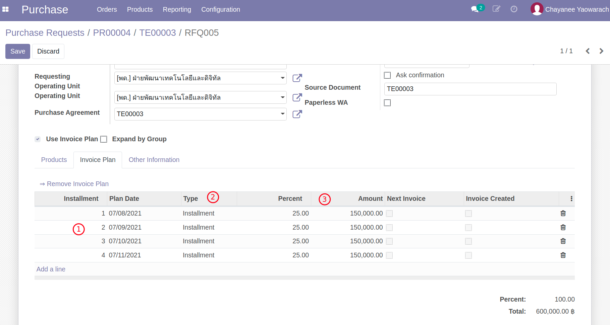

# กระบวนการจัดซื้อจัดจ้าง (ส่วนเพิ่ม)

กระบวนการเพิ่มเติม สำหรับกรณีจัดซื้อจัดจ้างแยกหัวข้อเป็นเรื่องๆ ดังนี้

<!-- * วางเงินมัดจำ (Deposit) -->
* กรณีเงินงวด (Invoice Plan Installment)
* การสร้างเอกสารตรวจรับ (WA) กรณีมีเงินงวด (Invoice Plan)
<!-- * กรณีเงินงวดแบบมีเงินมัดจำ (Invoice Plan + 1st Deposit)
* เงินประกันผลงาน (Retention)
* หลักประกันสัญญา (RFQ Guarantee)
* หลักประกันการเสนอราคา/หลักประกันซอง (TE Guarantee กรณี e-Bidding)
* การทำสัญญา (Agreement) -->

**เอกสารนี้สำหรับ ::** เจ้าหน้าที่พัสดุ (Procurement Officer)

----------------------------------------------------------

<!-- ## วางเงินมัดจำ (Deposit)

เงินมัดจำหมายถึง เงินที่จ่ายให้กับ Vendor ล่วงหน้า ก่อนที่จะได้รับสินค้าหรือบริการ ซึ่งหลังจากที่ได้รับส่งมอบสินค้าหรือบริการแล้ว เงินส่วนนี้จะถูกหักออกจากการจ่ายเงินในงวดถัดๆไป

**Menu ::** Purchase > Orders > Purchase Orders

!!! Note
      - การบันทึกเงินมัดจำจะเกิดขึ้นกับเอกสาร Purchase Order ที่อนุมัติแล้วและต้องการจ่ายเงินมัดจำล่วงหน้า
      - ตัวอย่างนี้เราใช้กรณีซื้อบริการ (ไม่มีการรับสิ้นค้าเข้าคลัง)

1. สร้างเงินมัดจำ Deposit Invoice
      1. จากหน้าต่าง Purchase Order ที่อนุมัติแล้ว
      2. กดปุ่ม Request Deposit
            
      3. ใส่จำนวนเงินมัดจำเป็น เปอร์เซ็นต์ หรือ จำนวนเงิน
      4. กดปุ่ม Create and View Invoices
            

2. ระบบพาไปยังเอกสาร Deposit Invoice (Vendor Bill) ที่ถูกสร้างขึ้น  
      1. Draft Bill
      2. เอกสารนี้จะบันทึกบัญชีเป็น Purchase Deposit
      3. ยอดเงินตามจำนวนเงินมันจำ โดยมี Qty = 1 เสมอ
            

3. [สร้างเอกสารตรวจรับวัสดุ WA จาก PO](po3_for_procurement_officer.md#wa-po) ตามปกติ
4. สร้างใบแจ้งหนี้ Vendor Bill (หลังการตรวจรับด้วย WA เสร็จสิ้น)
      1. กดปุ่ม Create Bill จากหน้าต่าง Purchase Order
      2. เลือกเอกสาร Work Acceptance ที่ได้ทำการตรวจรับแล้ว
      3. กดปุ่ม Create Vendor Bill
            
      4. ระบบจะสร้าง Vendor Bill โดยจะมีการหักเงินในส่วนที่ได้วางมัดจำไปแล้ว
            

End.

---------------------------------------------------------- -->

## กรณีเงินงวด (Invoice Plan Installment)

เงินงวดหมายถึงการวางแผนการซื้อโดยแบ่งจ่ายเป็นงวดๆ ระบบจะใช้ตาราง Invoice Plan ในการเก็บสัดส่วนการจ่ายในแต่ละงวด

**Menu ::** Purchase > Orders > Requests for Quotation

!!! Note
      - การบันทึกเงินงวด จะบันทึกที่ RFQ ใบเสนอราคาจากผู้ขาย/ผู้ให้บริการที่ได้รับการคัดเลือกสถานะ Draft
      - Ref: [สร้างใบเสนอราคา RFQ (จาก Purchase Agreement/TE)](po3_for_procurement_officer.md#rfq-purchase-agreementte)

1. สร้าง Invoice Plan
      1. กดปุ่มเพื่อ Edit RFQ, และเลือก Use Invoice Plan เพื่อเปิดการใช้งาน Invoice Plan
      2. คลิกลิงค์ Create Invoice Plan เพื่อเปิด Wizard
      3. Number of installment: เลือกจำนวนงวดการแบ่งจ่ายที่ต้องการ
      4. Installment Date: เลือกวันที่การจ่ายงวดแรก
      5. Interval: เลือกช่วงเวลาระหว่างงวด (เป็นแค่ตัวช่วย)
      6. กดปุ่ม Create Invoice Plan เพื่อสร้างตารางการแบ่งจ่าย
            

2. ปรับรายละเอียดตาราง Invoice Plan
      1. Installment: แสดงงวดการจ่าย
      2. Type: ประเภท (Installment/Deposit)
      3. Percent, Amount: จำนวนเงินในแต่ละงวด
            

    !!! Note
          - สามารถแก้ไข เพิ่ม/ลด ตารางได้ตามต้องการในสถานะเอกสาร Draft
          - แต่ยอดรวม % ต้องเท่ากับ 100 เสมอ

End.

----------------------------------------------------------

## การสร้างเอกสารตรวจรับ WA กรณีใช้ Invoice Plan

**Menu ::** Purchase > Orders > Purchase Orders

!!! Note
      - ขั้นตอนนี้สำหรับ Purchase Order ที่อนุมัติแล้ว (Approved) และมีการใช้ Invoice Plan
      - การตรวจรับ WA จะถูกบังคับสร้างตามงวดที่วางไว้ที่ Invoice Plan (Create WA by Installment)

1. จาก Purchase Order ทำการสร้างเอกสารตรวจรับ WA
      1. กดปุ่ม Create WA by Installment ระบบจะเปิด Wizard
      2. เลือกงวด Installment ที่ต้องการสร้าง WA
            
      3. กดปุ่ม Create WA ระบบจะพาไปยังเอกสาร WA ที่สร้างขึ้น
      4. จะเห็นว่า Quantity บน WA จะเป็นไปตามสัดส่วนของ Installment ที่เลือกโดยอัตโนมัติ
            

2. ทำการอนุมัติ / ประเมิน / ค่าปรับ เอกสาร WA นี้ตามปกติ

    !!! Note
          - เอกสาร WA ที่อนุมัติแล้ว จะถูกใช้ในการควบคุมการรับวัสดุ และการสร้างใบแจ้งหนี้ตามปกติต่อไป

End.

<!-- ----------------------------------------------------------

## กรณีเงินงวดแบบมีเงินมัดจำ (Invoice Plan + Deposit)

**Menu ::** Purchase > Orders > Requests for Quotation

!!! Note
      - การบันทึกเงินงวด + เงินมัดจำบน Invoice Plan จะบันทึกที่ RFQ 
      - Ref: [สร้างใบเสนอราคา RFQ (จาก Purchase Agreement/TE)](po3_for_procurement_officer.md#rfq-purchase-agreementte)

1. สร้าง Invoice Plan
      1. กดปุ่มเพื่อ Edit RFQ, และเลือก Use Invoice Plan เพื่อเปิดการใช้งาน Invoice Plan
      2. คลิกลิงค์ Create Invoice Plan เพื่อเปิด Wizard
      3. Number of installment: เลือกจำนวนงวดการแบ่งจ่ายที่ต้องการ
      4. **Deposit on 1st Invoice**: เลือกเพื่อให้มี Installment ที่ 0 สำหรับ Deposit
      5. Installment Date: เลือกวันที่การจ่ายงวดแรก
      6. Interval: เลือกช่วงเวลาระหว่างงวด (เป็นแค่ตัวช่วย)
      7. กดปุ่ม Create Invoice Plan เพื่อสร้างตารางการแบ่งจ่าย
            

2. ปรับรายละเอียดตาราง Invoice Plan
      1. Installment 0 คือ Deposit
      2. ใส่ Percent หรือ Amount (ซึ่งจะตำนวนกลับเป็น %)
      3. กดปุ่ม Create Invoice เพื่อสร้าง Deposit Invoice
            

    !!! Note
          - การสร้าง Deposit Invoice จะเป็นใบแจ้งหนี้แรกที่ถูกสร้าง และสามารถทำได้โดยที่ยังไม่มีการตรวจรับ
          - ถ้าผู้ใช้พยายามสร้าง Bill อื่นก่อนที่จะสร้าง Deposit Invoice ระบบจะไม่อนุญาต

End.

----------------------------------------------------------

## RFQ เงินประกันผลงาน (Retention)

**Menu ::** Purchase > Orders > Requests for Quotation

!!! Note
      - เงินประกันผลงาน คือ การหักเงินประกันจากเงินงวดในอัตราร้อยละหรือจำนวนเงินที่เท่าๆ กัน ทุกงวด
      - บันทึกอัตราร้อยละหรือจำนวนเงินประกันผลงาน ที่ Invoice Plan เท่านั้น
      - เจ้าหน้าที่พัสดุกำหนดอัตราร้อยละหรือจำนวนเงินประกันผลงาน (ข้อ 1) แต่การหักเงินประกันผลงานจะถูกบันทึกโดยฝ่ายบัญชีตอนจ่ายชำระเงินงวดแก่ผู้ขาย/ผู้ให้บริการ

1. กำหนดอัตราการหักเงินแต่ละงวด เป็นอัตราร้อยละหรือจำนวนเงิน เพื่อการประกันผลงาน
      

       

2. ดำเนินการอนุมัติ RFQ ไปจนถึงการตรวจรับวัสดุ WA ในแต่ละงวดตามกระบวนการปกติ
3. เมื่อถึงขั้นตอนการออกใบแจ้งหนี้ให้กดปุ่ม Create Bill เลือก WA เพื่อสร้าง Invoice ตามปกติ
4. ดูเอกสาร Vendor Bills ที่สร้างขึ้น
      1. ระบบจะสร้างเอกสารใบแจ้งหนี้ให้ ซึ่งเมื่อคลิกที่ปุ่ม "Vendor Bills" ระบบจะแสดงใบแจ้งหนี้ที่ถูกสร้างตาม WA และ Invoice Plan
            
      2. คลิกเข้าไปดูในแต่ละเอกสารที่สร้างขึ้นจะเห็นว่า มีการหักเงินประกันผลงานไว้ในแต่ละใบแจ้งหนี้
            
            

End.

----------------------------------------------------------

## RFQ หลักประกันสัญญา (Guarantee ที่ RFQ)

**Menu ::** Purchase > Orders > Requests for Quotation

!!! Note
      - สร้างหลักประกันสัญญา ที่ RFQ ใบเสนอราคาจากผู้ขาย/ผู้ให้บริการที่ได้รับการคัดเลือก ก่อนการยืนยันเอกสารเพื่อเปลี่ยนสถานะเป็น Purchase Order ใบสั่งซื้อสั่งจ้าง
      - เจ้าหน้าที่พัสดุบันทึกหลักประกันสัญญาในตารางเท่านั้น (ข้อ 1)
      - การบันทึกหลักประกันสัญญาและการคืนหลักประกันสัญญาเมื่อครบกำหนด จะดำเนินการโดยการเงินบัญชี

1. จาก RFQ ที่ได้รับคัดเลือก สร้าง Guarantee ประเภท เงินประกันสัญญา
      1. กดปุ่ม "Guarantee"
            
      2. กดปุ่ม Create เพื่อสร้าง Guarantee สำหรับ RFQ นี้
            
      3. Reference / Guarantee Method / Partner จะปรากฏโดยอัตโนมัติ
      4. กรอกวิธีการชำระเงิน และจำนวนเงินหลักประกันสัญญา
      5. ข้อมูลอ้างอิงเอกสารการบันทึกหลักประกันสัญญาในระบบ และคืนหลักประกันสัญญา โดยการเงินบัญชี
      6. Link ไปยังเอกสารที่เกี่ยวข้อง
      

       

2. การเงินบัญชีบันทึกหลักประกันสัญญา (Customer Invoice -> Payment)
      
3. เมื่อถึงกำหนดการคืนหลักประกัน การเงินบัญชีดำเนินการคืนหลักประกัน (Vendor Bill -> Payment)
      
4. เอกสารหลักประกันทั้งหมด สามารถเรียกดูได้ที่เมนู Purchase > Orders > Guarantee
      

End.

----------------------------------------------------------

## หลักประกันการเสนอราคา/หลักประกันซอง (TE Guarantee กรณี e-Bidding)

**Menu ::** Purchase > Orders > Purchase Agreement

!!! Note
      - กรณี e-Bidding จะมีการวางหลักประกันการเสนอราคา/การประกันซองของทุกผู้ที่ยื่นซองประกวดราคา
      - เจ้าหน้าที่พัสดุบันทึกหลักประกันการเสนอราคาที่ TE (ข้อ 1)
      - การบันทกึหลักประกันการเสนอราคาและการคืนหลักประกันเมื่อประกาศผลการประกวดราคา ดำเนินการโดยการเงินบัญชี

1. ที่ TE สร้าง Guarantee ประเภท หลักประกันการเสนอราคา
      1. กดปุ่ม "Guarantee"
            
      2. กดปุ่ม Create เพื่อสร้าง Guarantee สำหรับ TE นี้
            
      3. Reference / Guarantee Method จะปรากฏโดยอัตโนมัติ
      4. กรอกชื่อผู้เสนอราคา วิธีการชำระเงิน และจำนวนเงินสำหรับหลักประกัน
      5. ข้อมูลอ้างอิงการบันทึกหลักประกันและการคืนหลักประกัน
      6. Link ไปยังเอกสารที่เกี่ยวข้อง
      

       

!!! Note
      - ในตัวอย่างนี้ไม่ต้องให้ฝ่ายบัญชีดำเนินการเรียกเก็บหลักประกัน เพราะเป็นประเภท Bank Guarantee (แต่ต้องอ้างถึงที่ฟิลด์ Document Ref)
      - สรุป Guarantee Type ที่ต้องมีการเรียกเก็บเงิน (Create Invoice ?)
            

End.

----------------------------------------------------------

## สร้างสัญญา (Agreement) สำหรับ RFQ/TE แบบมี Agreement

!!! Note
      - ขั้นตอนนี้ใช้สำหรับกรณีที่ TE เลือก PO Type = Agreement เท่านั้น โดย
      - RFQ ที่ได้สร้างจาก TE ประเภทนี้นี้ สามารถถูกนำไปอ้างอิงใน Agreement ได้
      - RFQ เหล่านี้จะไม่มีการ Request Validation แต่จะถูก Confirmed อัตโนมัติ เมือ Agreement ถูกใช้งาน (Activated)

**Menu ::** Agreements > Operations > Create Agreement From Template

1. กดเมนู Create Agreement From Template จะมีให้ใส่
    1. Template: Template ของสัญญา
    2. Title: หัวข้อของสัญญา
    
2. คลิกปุ่ม Create Agreement ระบบจะสร้างและดึงรายละเอียดของสัญญาตาม Template ที่เลือก
    
3. ใส่รายละเอียดคู่สัญญา ผู้ว่าจ้างและเลขที่ RFQ
    1. Partner: คู่สัญญา
    2. Partner Primary Contact: คนที่ลงนามสัญญาของคู่สัญญา
    3. Partner Witness: พยานของคู่สัญญา
    4. Company: ผู้ว่าจ้าง
    5. Company Primary Contact: คนที่ลงนามสัญญาของผู้ว่าจ้าง
    6. Company Witness: พยานของผู้ว่าจ้าง
    7. RFQ: เลขที่ใบเสนอราคา (แบบ PO Type = Agreement)
    
4. ใส่เงินงวดของสัญญา (Invoice Plan)
    1. คลิกเข้าไปที่ link เอกสาร RFQ
    
    2. กดปุ่ม Edit และเลือก Use Invoice Plan เพื่อเปิดการใช้งาน Invoice Plan
    
    3. คลิกลิงค์ Create Invoice Plan เพื่อเปิด Wizard
        1. Number of Installment: ใส่จำนวนงวดของสัญญา
        2. Installment Date: ใส่วันที่งวดแรกของสัญญา
        3. Interval: ช่วงเวลาระหว่างงวด (เป็นตัวช่วย)
        4. กดปุ่ม Create Invoice Plan เพื่อสร้างตารางการชำระเงินงวด
        
    4. ปรับรายละเอียดตารางการชำระเงินงวด
        1. Installment: หมายเลขงวดของการชำระเงิน
        2. Plan Date: วันที่ที่จะต้องชำระเงิน
        3. Type: ประเภทของ Invoice Plan (Installment, Deposit)
        4. Percent: ใส่เป็นเปอร์เซนต์การชำระในแต่ละงวดได้ ระบบจะคำนวณจำนวนเงิน (Amount) ในแต่ละงวดให้อัตโนมัติ
        5. Amount: จำนวนเงินในแต่ละงวด (ระบบจะแสดงเมื่อคลิก 3 จุดด้านขวาของตารางและเลือก Amount)
        
5. เงินงวดที่กรอกใน RFQ จะแสดงใน Agreement (ตาราง Invoice Plan ใน RFQ คือตารางเดียวกับที่อยู่บน Agreement)
    
6. ทดลองพิมพ์สัญญาโดยเข้าไปที่ Print > Contract Document (NxPO) จะเห็นข้อมูลบนเอกสารที่แสดงออกมาบน Form เช่น เงินงวด และที่ Highlight สีเขียวจะเป็นส่วนที่เจ้าหน้าที่พัสดุต้องแก้ไข
    
    
7. แก้ไขข้อความบนสัญญา ซึ่งจะมี 4 ส่วนคือ
    1. Recitals
    2. Sections
        1. Section 1 (Header): แสดงชื่อสัญญา
        2. Section 2 (Detail): รายละเอียดของคู่สัญญาและผู้ว่าจ้าง
        3. Section 3 (Footer): ส่วนที่ให้ลงลายมือชื่อของคู่สัญญาและผู้ว่าจ้าง
    3. Clauses: แต่ละข้อของสัญญา
    4. Appendices: ภาคผนวก
    
    
8. ถ้าข้อความบนสัญญาถูกต้องหมดแล้ว ให้พิมพ์สัญญาเพื่อเซ็นลงนามทั้ง 2 ฝ่าย และถ้าต้องการแนบสัญญากลับเข้าระบบ ให้คลิก Add attachments ด้านล่างเอกสาร

9. คลิก Active สัญญาและใส่ระยะเวลาของสัญญา
    1. Start Date: วันที่เริ่มต้นสัญญา
    2. Duration: ระยะเวลาของสัญญา ใส่เป็น ปี เดือน วัน ได้
    3. End Date: วันที่สิ้นสุดสัญญา ระบบจะคำนวณจาก Start Date + Duration
    4. คลิก Active Agreement
    
10. RFQ ที่ได้รับเลือกไปทำสัญญาจะถูก Confirmed และเปลี่ยนสถานะเป็น Purchase Order, RFQ ใบที่เหลือจะถูก Cancel พร้อมบันทึกเหตุผลการยกเลิก "ไม่ได้รับการคัดเลือก"
    

!!! Note
    - Template สัญญาใหม่สร้างได้ที่ Agreements > Configuration > Templates (ต้องมีความรู้ทางด้านการเขียน code มาบ้าง)
    - Template ที่เลือกตอนจังหวะสร้างสัญญาต้องอยู่ในสถานะ Active แล้วเท่านั้น
    - สัญญาที่สร้างเข้าไปดูได้ที่ Agreements > Operations > Agreements
    - สัญญาที่ยกเลิกหรือหมดอายุให้เข้ามา Inactive

End. -->