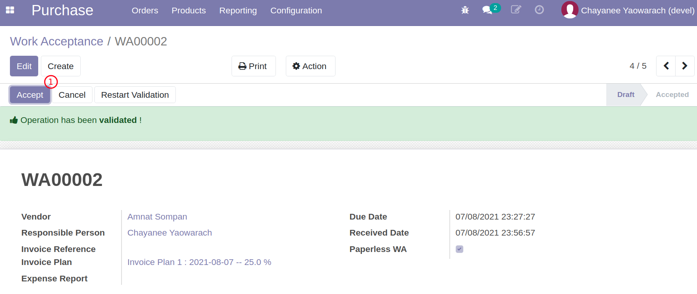

# กรรมการตรวจรับพัสดุ (Paperless)

ในบทอื่นเราได้พูดถึงกระบวนการตรวจรับพัสดุและเอกสารการตรวจรับ (WA) ไปแล้ว โดยจะเป็นการตรวจรับนอกระบบผ่านเอกสารกระดาษ (เซ็นต์ชื่อ) และเมื่อได้ข้อสรุปแล้ว ทางเจ้าหน้าที่พัสดุจึงจะเข้ามาในระบบเพื่อกรอกคะแนนการประเมินและกดปุ่มรับการตรวจในระบบ (Accepted)

แต่ในบทนี้จะพูดถึงกระบวนการการตรวจรับโดยคณะกรรมการในระบบแบบไร้กระดาษ Paperless โดยจะมีขั้นตอนโดยสังเขปดังต่อไปนี้

1. เจ้าหน้าที่พัสดุเป็นผู้สร้างเอกสารตรวจรับ WA ตามปกติ แต่จะเลือกเป็นแบบ Paperless WA ด้วย
2. เมื่อเลือก Paperless ที่ WA จะปรากฏปุ่ม Request Validation ซึ่งเจ้าหน้าที่พัสดุจะกดปุ่มนี้เพื่อเริ่มต้นการอนุมัติการตรวจรับ
3. ระบบจะมีการส่งข้อความ (email/inbox) ไปยังคณะกรรมการแต่ละคน (เช่น 3 คน)
4. คุณะกรรมการจะเข้ามาในระบบเพื่อบันทึกการตรวจรับพร้อมหมายเหตุ
5. เจ้าหน้าที่พัสดุ เมื่อเห็นว่า WA ใดที่กรรมการตรวจรับครบทุกคน จึงจะสามารถกดปุ่ม Accept เพื่อจบกระบวนการ

**เอกสารนี้สำหรับ ::** เจ้าหน้าที่พัสดุ และ กรรมการตรวจรับ 

----------------------------------------------------------

## เจ้าหน้าที่พัสดุเริ่มกระบวนการตรวจรับแบบ Paperless WA

**Menu ::** Purchase > Orders > Work Acceptance

1. เจ้าหน้าที่พัสดุเริ่มการตรวจรับแบบ Paperless WA
      1. สำหรับ WA เลือก "Paperless WA" จะมีปุ่ม Request Validation
      2. กดปุ่ม Request Validation
      3. คณะกรรมการทั้งหมดจะได้รับการแจ้งเตือน (email/inbox)
            
            
  
    !!! Note
        - ที่ Purchase Order มีฟิลด์ Paperless WA ด้วยเช่นกัน ซึ่งผู้ใช้งานสามารถกำหนดความเป็น Paperless WA ได้ตั้งแต่ PO เพื่อที่ WA ที่ถูกสร้างจะเป็น Paperless WA ตาม PO

End.

----------------------------------------------------------

## คณะกรรมการทำการตรวจรับในระบบ

**Menu ::** ไม่มีเมนู สามารถเข้าทาง inbox ส่วนตัว

1. คณะกรรมการทำการตรวจรับในระบบ
      1. กรรมการแต่ละคนเข้าถึงเอกสารที่ต้องตรวจรับ (Reviews Inbox)
            
      2. เลือกผลการตรวจรับ
         1. Validate: รับ
         2. Reject: ไม่รับ
         3. Others: อื่นๆและบอกเหตุผลเช่น ไม่เข้าร่วม
            
      3. ผลที่ได้จะกลับไปอัพเดทที่ตาราง Work Acceptance Committee
            

End.

----------------------------------------------------------

## เจ้าหน้าที่พัสดุเปลี่ยนสถานะเอกสาร WA เป็น Accepted

**Menu ::** Purchase > Orders > Work Acceptance

1. ตรวจสอบสถานะของเอกสาร WA บบ Paperless ในระบบ
      1. ใช้ตัวกรอง Filter ช่วยหาเอกสารที่เป็น Paperless หรือสถานะ Committee
      2. เอกสารที่่ผ่านการอนุมัติแบบ Paperless จะมีสีเขียวเมื่อผ่านการอนุมัติแล้ว และสีแดงเมื่อมีการปฏิเสธ
            

2. ทำการอนุมัติ Accept เอกสาร WA ที่ผ่านการอนุมัติแล้ว (รายการสีเขียว)
      1. กดปุ่ม Accept เพื่อจบการตรวจรับ
            

!!! Note
      - กรณี Paperless WA เจ้าหน้าที่พัสดุจะเปลี่ยนสถานะเป้น Accept ได้เฉพาะ WA ที่กรรมการตรวจรับแล้ว (รายการสีเขียว)
      - ก่อนการอนุมัติ หากมีผลการประเมิน สามารถกรอกได้ที่ Evaluation tab (ระบบยังไม่มีการบังคับกรอก เพราะอาจมีหรือไม่มี หรือกรอกเฉพาะการตรวจรับสุดท้าย)

End.